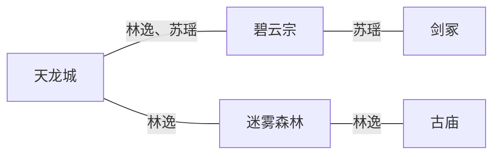

# 小说写作辅助

## 概述

帮助用户进行小说创作，管理复杂设定，追踪角色、物品、地点、伏笔、时间线等，确保长期写作的一致性。

**核心功能**：
- 多本小说管理（配置隔离）
- 完整设定追踪（角色、物品、地点、势力、时间线、伏笔）
- 大纲管理（三层：全书→卷→章节）+ 大纲排布方法论
- 章节写作（CHANGES变更声明协议、字数控制、设定自动回写、爽点标注、钩子检查、去AI味）
- 9 门禁校验（写作质量6门禁 + 引用校验 + 一致性校验 + 描写一致性 + 未知实体检测 + 蓝图出场合规）
- 事实快照集中管理（当前态快照 + 增量变更日志，解决 Big Doc 问题）
- 冲突检测（跨章位置/时间线/状态/物品）
- Mermaid关系图自动生成
- 题材框架 / 风格模块 / 质量检查按需加载

> **已融合精华**：story-deslop（去AI味）、story-long-write（钩子/爽点/大纲/期待感/开头设计）
> 参考文件在 [references/](references/) 目录下，按需加载。

## 配置

配置文件路径：`~/.openclaw/workspace/skills/novel-writer/configs/[小说名].json`

```json
{
  "info": {
    "name": "小说名",
    "type": "类型",
    "status": "ongoing/completed/paused",
    "created_at": "2026-04-16",
    "current_chapter": 10,
    "written_chapters": [1, 2, 3, 4, 5, 6, 7, 8, 9, 10],
    "total_words": 38000,
    "current_volume": 1,
    "last_sweet_spot": { "chapter": 10, "type": "装逼打脸" },
    "consecutive_no_spot": 0,
    "consecutive_same_type": 0,
    "last_hook_start": { "chapter": 10, "type": "悬念钩", "strength": "强" },
    "last_hook_end": { "chapter": 10, "type": "悬念钩", "strength": "强" },
    "consecutive_weak_hooks": 0,
    "last_emotion_peak": { "chapter": 10, "emotion": "震撼", "intensity": 9 },
    "consecutive_flat_emotion": 0
  },
  
  "save_location": "yuque",
  
  "backup": {
    "mode": "yuque_history",
    "local_path": null
  },
  
  "yuque": {
    "content_book": {
      "book_id": "12345678",
      "namespace": "yehuoshun/novel-content"
    },
    "settings_book": {
      "book_id": "87654321",
      "namespace": "yehuoshun/novel-settings"
    },
    "groups": {
      "characters_protagonist": "uuid",
      "characters_antagonist": "uuid",
      "characters_supporting": "uuid",
      "characters_deceased": "uuid",
      "items": "uuid",
      "locations": "uuid",
      "factions": "uuid",
      "foreshadowing": "uuid",
      "timeline": "uuid",
      "outline": "uuid",
      "dialogs": "uuid",
      "level_system": "uuid",
      "change_log": "uuid",
      "sweet_spot_tracking": "uuid",
      "hook_tracking": "uuid",
      "detailed_outline": "uuid",
      "emotion_arc": "uuid",
      "snapshot": "uuid",
      "changes": "uuid"
    }
  },
  
  "local": {
    "content_path": "D:/小说/小说名/正文",
    "settings_path": "D:/小说/小说名/设定"
  },
  
  "writing": {
    "pov": "first-person/third-person",
    "perspective": "single/multi",
    "style": "classical/modern/humorous/serious",
    "narrative_style": "fast-paced/slow-burn/detailed",
    "chapter_words": {
      "min": 2000,
      "max": 4000
    }
  }
}
```

**配置说明**：
- `save_location`：默认保存位置（yuque / local / both）
- `backup.mode`：备份模式
  - `yuque_history`（默认）：依赖语雀历史版本功能，不另做本地备份
  - `local`：在指定本地路径自动生成备份快照
- `backup.local_path`：本地备份路径（仅当 backup.mode=local 时需要）
- `info.written_chapters`：已写章节编号列表，用于追踪写作进度
- `yuque.groups`：语雀分组UUID（仅语雀需要）
- `local.path`：本地保存路径（仅本地需要）
- `writing`：文风设定，初始化时通过问答确定

**命名约定**：
- 设定文档名称：中文命名（如「张三.md」「天龙城.md」）
- JSON 配置 key：英文命名（如 `characters_protagonist`）
- 文件命名冲突处理：加入地点前缀（如「龙城_张三.md」）

## 命令列表

### 初始化相关

#### 新建小说
```
新建小说 [小说名]
```
**流程**：
1. 问：「小说类型是？」
2. 问：「正文保存到语雀还是本地？」
   - 语雀 → 问：「正文知识库ID和namespace」
   - 本地 → 问：「正文保存路径」（默认：小说名/正文/）
3. 问：「设定保存到语雀还是本地？」
   - 语雀 → 问：「设定知识库ID和namespace」
   - 本地 → 问：「设定保存路径」（默认：小说名/设定/）
4. 问：「人称？（第一人称/第三人称）」
5. 问：「视角？（单主角/多主角/群像）」
6. 问：「文风？（古风/现代/幽默/严肃）」
7. 问：「叙事节奏？（快节奏/慢热/细腻）」
8. 问：「每章字数范围？（默认2000-4000）」
9. 问：「小说类型相关设定」（每道题标注「可随时输入"够了"跳过」）
   - 玄幻/修仙：修炼体系、等级设定...
   - 都市：势力关系、职业设定...
   - 科幻：科技水平、世界观...
10. 生成配置文件，发给你确认
11. 你确认后，创建设定文档模板
12. 根据存储方式创建设定目录结构：
    - **语雀模式**：调用语雀 API（`PUT /repos/{book_id}/toc`）自动创建目录分组，获取各分组 UUID 回写配置
      - 新增分组：`snapshot`（状态快照 DOC）+ `changes`（变更记录 TITLE）
    - **本地模式**：在设定路径下创建完整的本地目录树（角色设定/主角+反派+配角+已故、物品设定、地点设定、势力设定、等级体系、时间线、伏笔追踪、爽点追踪、钩子追踪、情绪曲线、大纲/细纲、关键对话、世界观、Mermaid关系图、变更日志、状态快照.md、changes/）
13. 开始写全书大纲

**设定问答中途停止**：
- 用户输入「够了」→ 用已有信息生成设定
- 提示：「后续可用"补充设定"或"更新设定"」

#### 切换小说
```
切换小说 [小说名]
切换小说 [配置文件路径]
```
**流程**：
1. 校验配置文件是否存在、格式是否正确
2. 清除上一个小说的设定缓存（上下文隔离）
3. 加载新小说配置
4. 提示切换成功

**配置校验**：
- 检查必需字段：`info.name`、`save_location`
- 检查存储路径有效性
- 若配置损坏或缺失，报错并提示修复路径

#### 状态
```
状态
```
显示当前进度：
- 当前写到第几章/第几卷
- 总字数
- 未揭晓伏笔数量
- 待处理设定冲突（如果有）
- 最近爽点间隔（正常 / 连续X章无爽点 / 同类型爽点连用X次）
- 最近钩子：章首{类型}({强度}) / 章尾{类型}({强度})
- 最近情绪：最高{情绪}({强度})（连续X章平稳）
- 最近更新

### 大纲相关

#### 写大纲
```
写大纲
```
**流程**：
1. 加载 [references/outline-arrangement.md](references/outline-arrangement.md)（大纲方法论+五步大纲法+节点设计）
2. 问：「写到什么程度？」
   - 卷级：每卷主题、关键转折、起始→结束状态
   - 章节级：每章核心事件、爽点类型、钩子类型
3. 问：「需要生成前30章细纲吗？」（推荐生成）
   - 细纲附：核心事件+爽点类型+章首钩子+章尾钩子+字数目标
4. 生成大纲时自动标记关键节点：
   - 第1章：钩子节点（留住读者）
   - 第10章左右：第一个小高潮
   - 第30章左右：第一个大高潮/转折
   - 每卷末：卷级高潮
5. 生成后跑剧情质量检查：
   - 核心冲突是否明确？
   - 升级感是否清晰（境界/地位/势力递进）？
   - 每卷是否有明确功能（铺垫/爆发/转折/收尾）？
6. 发给你确认
7. 确认后保存（全书大纲+卷大纲+章节细纲）

**细纲格式**：
```
| 章 | 核心事件 | 爽点类型 | 章首钩子 | 章尾钩子 | 字数 |
|----|----------|----------|----------|----------|------|
| 1 | 穿越觉醒 | 信息差碾压 | 悬念钩 | 悬念钩 | 3000 |
| 2 | 首战立威 | 装逼打脸 | 冲突钩 | 新角色钩 | 3200 |
```

#### 查大纲
```
查大纲
查大纲 [卷号]
查大纲 [章节号]
```

### 写作相关

#### 写章节
```
写章节 [章节号]
写章节 [章节标题]
写章节          # 不指定时，默认写最新章节（info.current_chapter + 1）
```
**流程**：

**阶段一：准备**
1. 校验配置文件有效性
2. 加载事实快照：读取 `状态快照.md`（当前所有实体状态，不读历史）
3. 按需加载相关设定（本章涉及的角色/地点/物品的详细档案）
4. 参考本章细纲（含蓝图出场清单），必要时加载 [references/outline-arrangement.md](references/outline-arrangement.md) 和 [references/expectation-techniques.md](references/expectation-techniques.md)
5. 生成这章大纲（标注：核心事件、本章爽点类型、章首钩子类型、章尾悬念）
6. 发给你确认
7. 你确认/修改

**阶段二：写作 + 变更声明**
8. 写正文（实时字数提醒：3500字提醒进度，4000字提醒上限，不低于2000字）
   - 参考 [references/style-modules.md](references/style-modules.md) 确保文风一致
   - 参考 [references/hook-techniques.md](references/hook-techniques.md) 确保钩子到位
9. **AI 必须在正文后输出 `---CHANGES---` 变更声明块**（见下方「CHANGES 变更声明协议」）

**阶段三：9 道门禁校验**（全部自动，不通过则打回 AI 重写）
10. **写作质量门禁**（6 Gate，已有）：加载 [references/anti-ai-writing.md](references/anti-ai-writing.md) 和 [references/banned-words.md](references/banned-words.md)
    - Gate 1 禁用词 | Gate 2 AI句式 | Gate 3 心理外化 | Gate 4 节奏 | Gate 5 对话 | Gate 6 结尾
11. **引用校验**（新增）：CHANGES 中声明的角色/地点/物品/势力 ID 是否在设定中存在
    - 引用不存在的 ID → 打回，标注"未登记实体：XXX"
12. **一致性校验**（新增）：CHANGES 的声明是否与事实快照矛盾
    - 例：快照中张三在烈焰谷，CHANGES 声明张三从天剑宗出发 → 矛盾
    - 例：快照中李四已死亡，CHANGES 声明李四状态变化 → 矛盾
13. **描写一致性校验**（新增）：正文中角色外貌描写是否与角色档案矛盾
    - 加载本章出场角色的档案（发色、瞳色、外貌特征、性格标签）
    - 正文中写"张三的金色长发"但档案写黑发 → 打回
    - 正文中地点描写与地点特征档案矛盾 → 打回
14. **未知实体检测**（新增）：正文引入未登记的角色/地点/势力是否超阈值
    - 阈值：一章 ≤ 5 个新实体（区分有剧情作用的 vs 龙套）
    - 龙套（店小二、路人甲，出场 < 2 句且无姓名）不计入
    - 超阈值 → 打回，标注"新增实体过多：XXX"
15. **蓝图出场合规**（新增）：细纲/蓝图指定的角色/势力/地点是否在正文中实际出现
    - 蓝图列出张三、李四、王五 → 正文只写了张三 → 缺额 > 阈值 → 打回
    - 视角角色仅出现 1 次 → 警告「叙事力度不足」

**阶段四：落地 + 状态回写**
16. 门禁全部通过后 → 上传语雀/本地
17. **从 CHANGES 块提取变更**，自动更新设定：
    - 更新 `状态快照.md`（当前态覆盖，非追加）
      - 语雀模式：更新 `snapshot` 分组下的 DOC，用 `PUT /repos/{id}/docs/{doc_id}` 覆盖
      - 本地模式：覆盖 `设定/状态快照.md`
    - 保存 `ch{N}-changes.md` 到 `变更记录/` 分组（增量日志，永久保留）
      - 语雀模式：在 `changes` TITLE 节点下创建 DOC
      - 本地模式：保存到 `设定/changes/ch{N}-changes.md`
    - 更新各角色/地点/物品/势力/伏笔设定文档
18. **冲突检测**：状态回写后自动跑冲突检测（位置/时间线/角色状态/物品），有冲突则提示
19. 反馈更新内容（含门禁结果摘要 + 冲突检测结果）
20. 更新 `info.written_chapters` 列表
21. 更新配置追踪字段：
    - `info.last_sweet_spot` / `consecutive_no_spot` / `consecutive_same_type`
    - `info.last_hook_start` / `last_hook_end` / `consecutive_weak_hooks`
    - `info.last_emotion_peak` / `consecutive_flat_emotion`
22. 更新章节摘要（含爽点类型+铺放比、钩子类型+强度、情绪基调强度链）

**门禁结果输出格式**：
```
🛡️ 门禁结果（第X章）
  ✅ Gate 1-6 写作质量：通过（禁用词0 / AI句式1处已修正）
  ✅ 引用校验：通过（CHANGES 引用 5 个实体，均在设定中）
  ✅ 一致性校验：通过
  ✅ 描写一致性：通过
  ✅ 未知实体检测：通过（新增 2 个：路人甲-龙套不计入，黑风寨-已登记）
  ✅ 蓝图出场合规：通过（指定 3 人出场，实际 3 人）
```

#### CHANGES 变更声明协议

> AI 每章必须在正文后输出此块，格式固定。9 类声明不必全填，只填本章实际发生变化的类别。

```markdown
---CHANGES---
<!-- 角色状态变化 -->
- **[角色名]**：[旧状态]→[新状态] | 新增能力/失去能力 | 心理变化 | 关系变化（信任度增减）

<!-- 冲突进度 -->
- **[冲突名]**：[旧状态]→[新状态] | 推进事件：XXX

<!-- 新剧情节点 -->
- **[关键词]**：摘要 | 涉及角色 | 故事线（主线/支线）

<!-- 伏笔动作 -->
- 🔨埋设 **[伏笔名]**（Tier-X）| 线索描述
- ✅回收 **[伏笔名]**（第X章埋设）| 回收方式

<!-- 地点状态变化 -->
- **[地点名]**：[旧状态]→[新状态] | 触发事件

<!-- 势力状态变化 -->
- **[势力名]**：[旧状态]→[新状态] | 触发事件

<!-- 时间推进 -->
- 距上一章：X天 | 时段：[清晨/正午/黄昏/深夜] | 关键事件：XXX

<!-- 角色移动 -->
- **[角色名]**：[出发地]→[目的地]

<!-- 物品流转 -->
- **[物品名]**：[原持有者]→[新持有者] | 方式：[赠送/夺取/拾取/消耗] | 物品状态

---END CHANGES---
```

**CHANGES 协议规则**：
- `---CHANGES---` 和 `---END CHANGES---` 必须原样出现，用于自动提取
- 声明中的角色/地点/物品/势力名必须与设定文档中的名称精确一致
- 不发生的类别整段省略，不写「无变化」
- 龙套角色（无姓名、出场 < 2 句）不出现在 CHANGES 中

**写作技巧速查**：

| 场景 | 技巧 |
|------|------|
| 开篇 500 字 | 必须有钩子，不能从天气/风景开始（除非反差极大） |
| 对话 | 推进剧情或揭示性格，不能只凑字数 |
| 打斗 | 不写流水账，写策略和反转，不写「你一拳我一脚」 |
| 日常 | 有人物互动和伏笔，不能只是「吃饭睡觉」 |
| 爽点释放 | 铺垫要充分、释放要干脆，读者等得越久释放越要爽 |
| 章尾 | 每章结尾都要有让读者想翻下一页的东西 |

**字数与节奏参考**：

| 节奏 | 字数区间 | 内容密度 |
|------|----------|----------|
| 高速推进 | 2000-3000 字/章 | 每章一个明确事件 |
| 正常节奏 | 3000-4000 字/章 | 主线 + 少量副线 |
| 舒缓铺垫 | 3000-4000 字/章 | 人物互动 + 伏笔 |
| 高潮爆发 | 2000-3000 字/章 | 集中释放、不拖沓 |

写章节时根据本章节奏类型匹配对应字数和内容密度。

**开头技巧速查**（9 种，加载 [references/opening-design.md](references/opening-design.md) 获取完整指南）：

| 技巧 | 说明 | 示例 |
|------|------|------|
| 冲突前置 | 第一句就是矛盾 | 「离婚协议放在桌上，他已经签了。」 |
| 信息差钩 | 给读者一个角色不知道的信息 | 「她不知道，对面那个男人已经在计划第三次了。」 |
| 反常行为 | 用一个不合常理的行为引起好奇 | 「她把订婚戒指冲进了马桶。」 |
| 重生反常 | 重生后做前世绝不会做的事 | 「沈栀心念成灰，支着一口气找到了媒婆：郭家的那个天阉，我来嫁。」 |
| 超自然身份 | 开篇揭示非人类身份 | 「我是世上仅存的红衣厉鬼。我不知自己是怎么死的。」 |
| 灵魂旁观 | 以灵魂视角描述死亡现场 | 「我的尸体躺在透明棺材里，三个哥哥在外面笑着说：她演得真像。」 |
| 悬念句 | 抛出一个需要解释的事实 | 「我死后的第三天，老公发了一条朋友圈。」 |
| 替嫁被弃 | 被迫接受不公正的命运 | 「三个月后，我代替皇后的嫡亲公主坐上了去漠北和亲的轿撵。」 |
| 代入式提问 | 直接让读者产生共鸣 | 「你有没有在深夜接到过一个不该接的电话？」 |

**结尾类型速查**：

| 类型 | 效果 | 适合情绪 |
|------|------|----------|
| 余韵式 | 不说完，让读者自己想 | 意难平 |
| 呼应式 | 首尾呼应，形成闭环 | 治愈、成长 |
| 开放式 | 留下悬念 | 细思极恐 |
| 反转再反转 | 结尾再来一个小反转 | 震惊 |
| 金句式 | 一句话点题 | 共鸣 |

**保存位置**：
- 默认按配置文件的`save_location`
- 可临时指定：`写章节 [章节] --local` / `--both`

**设定加载策略**：
- 按需加载：读取当前章节涉及的角色、地点、物品设定
- 不全量加载所有设定（避免长篇小说 Token 爆炸）
- 如需其他设定，可在确认大纲时手动指定

#### 续写
```
续写
```
继续写当前未完成的章节。

**流程**：
1. 校验配置文件有效性
2. 恢复上下文：
   - 读取当前章节状态（`info.current_chapter`）
   - 读取已写内容的摘要（从语雀/本地获取）
   - 按需加载相关设定（当前场景涉及的角色、地点）
3. 问：「写到哪了？/ 当前场景是？」
4. 你告诉我场景/情节
5. 继续写
6. 写完后按写章节流程的阶段二～四走（CHANGES → 9 门禁 → 落地 → 状态回写）

#### 回溯
```
回溯 [章节号]
```
显示某章详情：
- 摘要
- 出场角色
- 发生地点
- 关键事件
- 爽点（类型+铺放比）
- 钩子（章首/章尾类型+强度）
- 情绪基调（强度链）
- 伏笔
- 时间线

### 设定相关

#### 更新设定
```
更新设定
```
手动更新设定。

#### 补充设定
```
补充设定
```
继续初始化时未完成的设定问答。

#### 查设定
```
查设定 [角色名]
查设定 [物品名]
查设定 [地点名]
查设定 [伏笔]
查设定 [时间线]
查设定 [势力]
```
**查询结果格式**：
```
【角色A】
位置：X城
状态：受伤
核心动机：复仇（深层原因：第5章家族灭门）
目标：逃离
上次出场：第10章
背包：剑、血瓶x2
等级：筑基期
关系：
  - B（朋友，亲密8，信任7，驱动力：救命之恩）
  - C（敌人，信任0，驱动力：利益冲突）
情绪变化：第5章愤怒→第8章接受
```

#### 查冲突
```
查冲突
```
检测设定冲突：
- 角色位置冲突
- 时间线冲突
- 物品归属冲突
- 角色状态冲突（已死角色出现）

**检测到冲突时**：
```
发现冲突：
- 第5章说角色A在X地
- 第10章说角色A在Y地（没写移动过程）
→ 请确认这是否是冲突？
→ 可能的解决方案：
  1. 修改第10章，补充移动过程
  2. 修改角色A在第5章的位置
```

### 其他命令

#### 更新图
```
更新图
更新图 [类型]
```
手动更新 Mermaid 关系图。默认自动更新，但可手动触发。

**支持的图表类型**：
- `地点`（默认）：地点关系图，展示地点之间的连接关系
- `角色`：角色关系图，展示角色之间的情感、阵营关系

**生成规则（地点图）**：
- 触发时机：写章节后、手动调用、新增地点时
- 节点：每个地点一个节点
- 连线：角色在两地间移动过则连线
- 标注：连线上标注移动过的角色名

**输出示例（地点关系图）**：


---

## 设定文档结构

### 语雀设定知识库

> 语雀没有文件夹概念，用 TOC 树实现：TITLE 节点 = 分组目录，DOC 节点 = 文档。
> 下面的树中，`/` 结尾的是 TITLE 分组节点，`.md` 结尾的是独立 DOC 文档。

```
设定知识库（根）
├── [TITLE] 角色设定/
│   ├── [TITLE] 主角组/
│   ├── [TITLE] 反派组/
│   ├── [TITLE] 配角组/
│   └── [TITLE] 已故角色/
├── [TITLE] 物品设定/
├── [TITLE] 地点设定/
├── [TITLE] 势力设定/
├── [TITLE] 等级体系/
├── [TITLE] 时间线/
├── [TITLE] 伏笔追踪/
├── [TITLE] 爽点追踪/
├── [TITLE] 钩子追踪/
├── [TITLE] 情绪曲线/
├── [TITLE] 大纲/
│   ├── [DOC] 全书大纲
│   ├── [TITLE] 卷大纲/
│   ├── [TITLE] 章节大纲/
│   └── [TITLE] 细纲/
├── [TITLE] 关键对话/
├── [TITLE] 世界观/
├── [TITLE] Mermaid关系图/
├── [TITLE] 变更日志/
├── [DOC] 状态快照          ← 独立 DOC，存当前所有实体状态
└── [TITLE] 变更记录/         ← TITLE 分组，存每章增量 CHANGES
    ├── [DOC] ch001-changes
    ├── [DOC] ch002-changes
    └── ...
```

**语雀 groups 映射**（配置文件 `yuque.groups`）：
| key | TITLE 节点 | 用途 |
|-----|-----------|------|
| `snapshot` | 状态快照（DOC） | `状态快照.md` 的 UUID |
| `changes` | 变更记录/（TITLE） | `changes/` 分组节点的 UUID |

### 本地设定文件夹

```
小说名/设定/
├── 角色设定/
│   ├── 主角/
│   ├── 反派/
│   ├── 配角/
│   └── 已故/
├── 物品设定/
├── 地点设定/
├── 势力设定/
├── 等级体系/
├── 时间线/
├── 伏笔追踪/
├── 爽点追踪/
├── 钩子追踪/
├── 情绪曲线/
├── 大纲/
│   └── 细纲/
├── 关键对话/
├── 世界观/
├── Mermaid关系图/
├── 变更日志/
├── 状态快照.md
└── changes/
    ├── ch001-changes.md
    ├── ch002-changes.md
    └── ...
```

---

## 状态快照

> 集中存储所有实体的**当前状态**，每章落地后从 CHANGES 增量更新。只存最新值，不存历史。
> 历史变更分散在 `changes/ch{N}-changes.md`，回溯时按需加载。
> Big doc 解决方案：快照大小随实体数增长（通常几百条），不随章节数增长。

```markdown
# 状态快照（截止第N章）

## 角色状态
| 角色 | 等级 | 当前位置 | 状态 | 背包 | 最后出场章 |
|------|------|----------|------|------|-----------|
| 张三 | 金丹期 | 烈焰谷 | 轻伤 | 天命剑、筑基丹×2 | 10 |
| 苏瑶 | 元婴期 | 天剑宗 | 健康 | — | 10 |

## 角色外貌（用于描写一致性校验）
| 角色 | 发色 | 瞳色 | 外貌特征 | 性格标签 |
|------|------|------|----------|----------|
| 张三 | 黑 | 黑 | 剑眉星目、身材修长 | 果决、隐忍 |
| 苏瑶 | 银白 | 蓝 | 冷艳、肤白如雪 | 清冷、腹黑 |

## 冲突进度
| 冲突 | 当前状态 | 最近事件 | 涉及角色 |
|------|----------|----------|----------|
| 正邪大战 | 激化 | 张三叛出宗门 | 张三、掌门 |

## 伏笔状态
| 伏笔 | Tier | 状态 | 埋设章 | 预期揭晓 |
|------|------|------|--------|----------|
| 假死真相 | 1 | 已埋·未收 | 30 | 60 |
| 古庙秘密 | 2 | 已收 | 8 | 25 |

## 地点状态
| 地点 | 当前状态 | 触发事件 | 相关章节 |
|------|----------|----------|----------|
| 烈焰谷 | 被封印 | 张三使用禁术 | 10 |
| 天剑宗 | 内乱中 | 掌门失踪 | 9 |

## 势力状态
| 势力 | 当前状态 | 触发事件 |
|------|----------|----------|
| 天剑宗 | 内乱中 | 掌门失踪 |

## 物品归属
| 物品 | 持有者 | 状态 |
|------|--------|------|
| 天命剑 | 张三 | active |
| 筑基丹×2 | 张三 | 完好 |

## 时间线（最近一章）
- 第10章：深夜 | 距上一章3天 | 关键事件：月圆之夜封印烈焰谷

## 世界观硬约束
| 规则 | 类型 |
|------|------|
| 凡人不可飞行 | 硬约束 |
| 金丹期以上可御剑 | 软约束 |
```

**更新规则**：
- 每章门禁通过后，从 CHANGES 块提取变更 → 覆盖快照中对应行
- 新增实体 → 追加新行；状态变化 → 覆盖旧值；物品消耗 → 删除行
- 快照不存历史，历史在 `changes/ch{N}-changes.md` 中

---

## 质量检查

写完一定章节后，加载 [references/quality-checklist.md](references/quality-checklist.md) 做检查。

**黄金三章专项**：写完前三章后自动跑评估：

| 维度 | 评分标准 |
|------|----------|
| 开篇钩子 | ★★★★★ |
| 主角塑造 | ★★★★★ |
| 爽点设计 | ★★★★★ |
| 世界观铺设 | ★★★★★ |
| 章尾悬念 | ★★★★★ |

参考 [references/opening-design.md](references/opening-design.md) 和 [references/genre-opening-database.md](references/genre-opening-database.md) 对比开篇质量。

**精修删减原则**：

改稿时逐句检查，凡符合以下条件者直接删或缩：

1. 不推动剧情的对话 → 删
2. 不铺垫反转的描写 → 删
3. 不推高情绪的心理活动 → 删
4. 读者能猜到的内容 → 缩短
5. 重复表达的情绪 → 合并

---

## 设定字段详解

### 角色设定

```markdown
# 角色名

## 基本信息
- 姓名：
- 性别：
- 年龄：
- 阵营：(主角/反派/中立)
- 分组：(主角组/反派组/配角组/已故)
- 首次出场：第X章
- 最后出场：第X章

## 外貌描述
[首次出场时的描述]

## 性格特点
[性格描述]

## 说话风格
[对话特点描述]

## 位置与状态
- 当前位置：
- 当前状态：(健康/轻伤/重伤/濒死/死亡)
- 状态历史：
  - 第X章：健康→轻伤（原因：被B打伤）
  - 第Y章：轻伤→健康（原因：恢复）

## 目标
- 当前目标：
- 核心动机：{生存/复仇/守护/变强/自由/回家/证明自己}
- 深层原因：{为什么是这个动机？关联事件/伏笔}
- 目标历史：
  - 第1-10章：生存
  - 第11-20章：复仇
- 动机变化预判：{未来可能转向什么方向}

## 关系
- 与A：(朋友→敌人)，亲密：8→3，信任：7→1
  - 关系驱动力：{利益冲突/情感羁绊/命运绑定/共同敌人}
  - 第5章建立友谊
  - 第15章决裂
- 与B：(师徒)，亲密：9，信任：8
  - 关系驱动力：{救命之恩/互相欣赏/利益交换}
  - 第3章初识 → 第8章拜师

## 背包
| 物品 | 数量 | 状态 | 获得章节 |
|------|------|------|---------|
| 剑 | 1 | 装备 | 第3章 |
| 血瓶 | 2 | 完好 | 第5章 |

## 技能
| 技能名 | 等级 | 类型 | 获得章节 |
|--------|------|------|---------|
| 火球术 | Lv2 | 主动 | 第2章 |

## 情绪变化
- 第5章：愤怒
- 第8章：悲伤→接受
- 第15章：鼓舞

## 成长轨迹
[关键成长事件]
```

### 物品设定

```markdown
# 物品名

## 基本信息
- 名称：
- 类型：(武器/防具/道具/消耗品/材料/任务物品/特殊物品)
- 重要性：(核心/普通/消耗)
- 首次出现：第X章

## 外观描述
[物品外观]

## 特性与能力
[物品能力描述]

## 属性
- 攻击力：
- 防御力：
- 特殊效果：

## 状态
- 当前状态：(完好/损坏/丢失/无主)
- 当前持有者：
- 获得章节：

## 流转历史
- 第X章：出现（地点：XXX）
- 第Y章：被A获得
- 第Z章：A→B（原因：赠送）
- 第W章：B使用消耗

## 隐藏属性
[未揭示的能力，标记「未揭晓」]

## 关联伏笔
- [伏笔-神秘钥匙]：第X章埋下
```

### 地点设定

```markdown
# 地点名

## 基本信息
- 名称：
- 类型：(城市/区域/建筑/秘境)
- 势力归属：
- 危险等级：(安全/低危/中危/高危/极度危险)
- 首次出现：第X章

## 特点描述
[地点描述]

## 相关角色
- A：当前在此
- B：到此一游（第X章）

## 发生事件
- 第X章：A与B在此战斗
- 第Y章：C发现秘密

## 探索进度
- 首次到访：第X章
- 探索度：30%
- 已发现：XX区域
- 未探索：核心区域

## 关联伏笔
- [伏笔-古城秘密]：第X章埋下
```

### 势力设定

```markdown
# 势力名

## 基本信息
- 名称：
- 类型：(王国/宗门/组织/帮派)
- 领导者：
- 势力范围：[地点列表]
- 首次出现：第X章

## 目标
[势力目标]

## 成员
- 领导者：A
- 核心成员：[角色列表]
- 普通成员：[角色列表]

## 与其他势力关系
- 与B势力：敌对
  - 第X章开战
- 与C势力：同盟

## 关键事件
- 第X章：成立
- 第Y章：与B势力开战
```

### 时间线

```markdown
# 时间线

## 世界观历法
[历法描述，如：第一纪元]

## 时间线记录
### 第1天（第1章）
- A出发前往X城
- B在Y城遭遇袭击

### 第2天（第2-3章）
- A到达X城
- B与C相遇

### 第5天（第10章）
【时间跳跃：距上一章3天】
- A开始修炼

...
```

### 伏笔追踪

```markdown
# 伏笔追踪

## 核心伏笔

### 伏笔：神秘人的身份
- 优先级：核心
- 埋设章节：第5章
- 内容：A在梦中见到神秘人
- 预期揭晓：第30章左右
- 状态：进行中
- 关联角色：A、神秘人
- 揭晓情况：未揭晓

## 普通伏笔

### 伏笔：古老咒语
- 优先级：普通
- 埋设章节：第8章
- 内容：A捡到古老卷轴
- 状态：进行中
- 揭晓情况：未揭晓

## 彩蛋伏笔

### 伏笔：隐藏的彩蛋
- 优先级：彩蛋
- 埋设章节：第15章
- 内容：路人说的冷笑话暗示剧情
- 状态：进行中
- 揭晓情况：可选揭晓
```

### 爽点追踪

```markdown
# 爽点追踪

## 爽点间隔
| 章节 | 爽点类型 | 铺放比 | 备注 |
|------|----------|--------|------|
| 1 | 装逼打脸 | 3:1 | |
| 2 | 无 | - | ⚠️ 连续无爽点 |
| 3 | 获得机缘 | 1.5:1 | |

## 类型统计
| 类型 | 使用次数 | 最近章节 |
|------|---------|---------|
| 装逼打脸 | 5 | 第20章 |
| 逆袭反转 | 3 | 第18章 |
| 获得机缘 | 4 | 第19章 |

## 警报
- 第2章：无爽点（连续1章）
- 第10-12章：装逼打脸连用3次 → 建议换类型
```

### 钩子追踪

```markdown
# 钩子追踪

## 章首钩子
| 章节 | 类型 | 强度 |
|------|------|------|
| 1 | 冲突钩 | 强 |
| 2 | 悬念钩 | 中 |
| 3 | 反差钩 | 强 |

## 章尾钩子
| 章节 | 类型 | 强度 |
|------|------|------|
| 1 | 悬念钩 | 强 |
| 2 | 新角色钩 | 中 |
| 3 | 危机钩 | 强 |

## 警报
- 第15-17章：章尾钩子连续3章强度为弱 → 读者流失风险
- 第20章：章首无钩子
```

### 情绪曲线

```markdown
# 情绪曲线

## 情绪走势
| 章节 | 开头情绪 | 中段情绪 | 结尾情绪 | 情绪极值 | 反转点 |
|------|----------|----------|----------|----------|--------|
| 1 | 好奇(5) | 紧张(7) | 震撼(9) | 震撼(9) | — |
| 2 | 紧张(6) | 压抑(8) | 释放(4) | 压抑(8) | 章尾反转 |
| 3 | 平静(4) | 疑惑(6) | 悬疑(7) | 悬疑(7) | — |

## 反转记录
| 章节 | 反转类型 | 铺垫线索 | 误导方向 | 情绪差（前后） | 合理评分 |
|------|----------|----------|----------|--------------|----------|
| 2 | 身份反转 | 第1章暗示 | 指向路人甲 | 8→4=差4 | ★★★★☆ |

## 警报
- 第3-5章：连续3章情绪极值≤5 → 情绪太平
- 第10章：反转情绪差仅1 → 力度不足
```

### 章节摘要

```markdown
# 第X章摘要

## 基本信息
- 标题：
- 字数：3800
- 发生地点：X城、Y森林
- 时间推进：距上一章3天
- 情绪基调：紧张(7) → 释放(3) → 悬疑(8)

## 出场角色
- A（主角）
- B（配角）
- C（反派）

## 主要事件
- A与B在X城相遇
- 发现古庙秘密
- C出现，战斗爆发
- A使用【火球术】击败C

## 关键事件
- 埋下伏笔：神秘人线索
- 角色状态：A轻伤

## 发生地点
- X城（主要）
- Y森林（开头）

## 物品变化
- A获得：神秘钥匙
- A消耗：血瓶x1

## 时间线
- 第X天：本章发生

## 爽点
- 类型：{装逼打脸/逆袭反转/获得机缘/信息差碾压/情感满足/扮猪吃虎}
- 铺垫字数：{X}
- 释放字数：{Y}
- 铺放比：{X:1}

## 钩子
- 章首钩子类型：{悬念钩/冲突钩/反差钩/代入钩/信息差钩}
- 章尾钩子类型：{悬念钩/反转钩/新信息钩/新角色钩}
- 钩子强度：{强/中/弱}

## 伏笔
- 埋下：[伏笔-神秘钥匙]（优先级：核心）
- 推进：[伏笔-古老咒语]
```

### 等级体系

```markdown
# 修炼等级体系

## 等级列表
1. 炼气期
2. 筑基期
3. 金丹期
4. 元婴期
5. 化神期
...

## 等级详解
### 炼气期
- 描述：初入修仙
- 特点：可使用简单法术
- 寿命：150年
- 突破条件：积累灵气

### 筑基期
- 描述：根基初成
- 特点：御剑飞行
- 寿命：300年
- 突破条件：筑基丹

...

## 角色等级追踪
| 角色 | 当前等级 | 突破章节 |
|------|---------|---------|
| A | 筑基期 | 第10章突破 |
| B | 金丹期 | 第20章突破 |
```

### 对话记录

```markdown
# 关键对话记录

## 第5章
**对话A**
- 角色：A → B
- 内容：「我会回来」
- 类型：誓言/伏笔
- 后续：待兑现（第30章）

## 第10章
**对话B**
- 角色：C → A
- 内容：「你的身世并不简单」
- 类型：伏笔
- 后续：揭示身份（第25章）
```

### 变更日志

```markdown
# 变更日志

## 2026-04-16 第10章写作后
- 类型：自动更新
- 触发：写章节完成后
- 变更内容：
  - 角色A 位置：X城→Y城
  - 角色A 状态：健康→轻伤（被B打伤）
  - 物品「神秘钥匙」：新增，归属角色A
  - 时间推进：第X天→第X+3天
  - 新增伏笔：神秘人线索（核心）
- 影响章节：无

## 2026-04-15 手动修正
- 类型：手动更新
- 操作人：作者
- 变更内容：
  - 角色「张三」改名「张四」
  - 地点「龙城」更名为「天龙城」
- 影响章节：第1、3、5、7章
- 备注：需要后续章节统一修改
```

**变更类型**：
- `自动更新`：写章节后自动检测到的设定变化
- `手动更新`：作者主动修改设定
- `冲突修复`：解决设定冲突后的变更

**必填字段**：
- `类型`：变更类型
- `变更内容`：具体变更了什么
- `影响章节`：受到影响的章节编号列表

### 大纲

```markdown
# 全书大纲

## 核心主线
[全书主线描述]

## 主题
[主题思想]

## 预计卷数
X卷

## 关键转折点
- 第X章：XXX
- 第Y章：XXX

---

# 第一卷大纲

## 卷名
[卷名]

## 主题
[本卷主题]

## 关键事件
1. XXX
2. XXX
3. XXX

## 章节大纲
- 第1章：XXX
- 第2章：XXX
...

## 状态
- 未开始 / 写作中 / 已完成

## 关键节点
- 第1章（钩子节点）：留住读者
- 第X章（第一个小高潮）
- 第Y章（第一个大高潮/转折）
- 卷末（卷级高潮）

---

# 细纲（前30章）

| 章 | 核心事件 | 爽点类型 | 章首钩子 | 章尾钩子 | 字数目标 |
|----|----------|----------|----------|----------|----------|
| 1 | | | | | |
| 2 | | | | | |
...

## 升级感设计
- 境界/等级递进路线
- 势力/地位变化节点
- 人际关系发展节点
```

---

## 工作流程

### 初始化流程

```
用户：新建小说「天龙传说」
↓
我：小说类型是？（玄幻/都市/科幻...）（可随时输入"够了"跳过剩余问题）
用户：玄幻修仙
↓
我：正文保存到语雀还是本地？
用户：语雀
↓
我：正文知识库ID？
用户：12345678
↓
我：正文知识库namespace？
用户：yehuoshun/tianlong-content
↓
我：设定保存到语雀还是本地？
用户：语雀
↓
我：设定知识库ID？
用户：87654321
↓
我：设定知识库namespace？
用户：yehuoshun/tianlong-settings
↓
我：人称？（第一人称/第三人称）
用户：第三人称
↓
我：视角？（单主角/多主角/群像）
用户：多主角
↓
我：文风？（古风/现代/幽默/严肃）
用户：古风
↓
我：叙事节奏？（快节奏/慢热/细腻）
用户：慢热
↓
我：每章字数范围？（默认2000-4000）
用户：默认就行
↓
我：修仙等级体系是什么？（如炼气→筑基→金丹）
用户：炼气期、筑基期、金丹期、元婴期、化神期
↓
[继续问玄幻相关设定，用户可随时「够了」停止]
↓
我：生成配置文件
[展示配置]
↓
我：确认配置？
用户：确认
↓
我：创建设定文档模板
↓
我：[根据存储方式创建目录]
- 语雀：调用 API 创建目录分组，UUID 回写配置
- 本地：创建完整目录树（角色设定/物品设定/...全部16个分组）
↓
开始写全书大纲
```

### 写章节流程

```
用户：写章节 10
↓
我：加载事实快照 + 本章细纲（含蓝图出场清单）
↓
我：生成章节大纲（标注：核心事件、爽点类型、出场角色、钩子类型）
[展示大纲]
↓
我：确认大纲？（可修改）
用户：确认
↓
我：写正文 + CHANGES 变更声明
[实时字数提醒：3500字/4000字]
↓
我：🛡️ 9 道门禁自动执行
  ✅ Gate 1-6 写作质量：通过
  ✅ 引用校验：通过（CHANGES 引用 5 个实体，均在设定中）
  ✅ 一致性校验：通过
  ✅ 描写一致性：通过
  ✅ 未知实体检测：通过（新增 1 个：黑风寨-已登记）
  ✅ 蓝图出场合规：通过（指定 3 人出场，实际 3 人）
↓
我：上传章节 + 保存 changes/ch10-changes.md
↓
我：状态回写完成。冲突检测：无冲突。
  更新摘要：
  - 角色A 位置：X城→Y城
  - 角色A 状态：健康→轻伤（第10章，被B打伤）
  - 物品「神秘钥匙」：无主→角色A
  - 时间线：第X天→第X+3天
  - 伏笔「神秘人线索」：🔨埋设（Tier-1）
  - 状态快照已更新 | Mermaid图已更新
```

### 更新设定流程

```
用户：改设定：角色A其实在B城，不是X城
↓
我：这将影响：
- 第5章：角色A在X城与C相遇
- 第8章：角色A从X城出发
确认修改？
↓
用户：确认
↓
我：设定已更新，受影响章节已标记
```

### 角色首次登场流程

```
[写章节时检测到新角色]
↓
我：检测到新角色「配角D」，请提供信息：
- 性别？
- 年龄？
- 阵营？（主角/反派/中立）
- 核心动机？（生存/复仇/守护/变强/自由/证明自己）
- 外貌描述？（可选）
- 性格特点？（可选）
用户：男，25岁，中立，守护家族，身材魁梧，沉默寡言
↓
我：已创建角色「配角D」，分组：配角组
```

---

## 特殊功能

### 爽点追踪

每章写完后自动追踪爽点密度和类型分布。

**爽点类型速查**：

| 类型 | 定义 | 示例 |
|------|------|------|
| 装逼打脸 | 实力碾压被轻视的人 | 废材一招秒天才 |
| 逆袭反转 | 绝境翻盘 | 绝境中突破 |
| 获得机缘 | 得到别人没有的东西 | 捡到神器/奇遇 |
| 信息差碾压 | 读者和主角知道、别人不知道 | 重生者先知优势 |
| 情感满足 | 人物关系进展 | 告白/团聚/认可 |
| 扮猪吃虎 | 隐藏实力突然展露 | 装弱实则强者 |

**追踪规则**：
- 每 3000-5000 字必须有一个爽点
- 连续 2 章无爽点 → 自动提醒
- 同一类型爽点连用 3 次 → 提醒换类型

**爽点间隔追踪示例**：
```
第1章：装逼打脸（铺放比3:1）
第2章：无爽点 ← ⚠️ 连续无爽点
第3章：获得机缘（铺放比1.5:1）
...
```

### 钩子追踪

每章写完后自动检查钩子质量。

**钩子类型速查**：

| 章首钩子 | 定义 | 示例 |
|----------|------|------|
| 悬念钩 | 抛出未解之谜 | 「这把剑为什么会认他为主？」 |
| 冲突钩 | 直接展示对抗 | 开篇就是追杀 |
| 反差钩 | 违反常识的信息 | 「穿越第一天就破产了」 |
| 代入钩 | 让读者产生共鸣 | 和读者处境相似的困境 |
| 信息差钩 | 给读者角色不知道的信息 | 「他还不知道，站在他面前的是…」 |

| 章尾钩子 | 定义 |
|----------|------|
| 悬念钩 | 抛出谜题等下一章解答 |
| 反转钩 | 章尾突然反转 |
| 新信息钩 | 揭示新信息打破认知 |
| 新角色钩 | 引人注目的人物登场 |
| 危机钩 | 章尾陷入危险 |
| 决策钩 | 角色面临重大选择 |

**自动检查**：
- 章首无钩子（前 500 字内）→ 提醒
- 章尾无钩子 → 提醒「读者不会翻下一页」
- 连续 3 章钩子强度评为「弱」→ 提醒

### 群像角色分工

多主角/群像作品时，加载 [references/character-design.md](references/character-design.md) 检查角色分工。

**检查维度**：

| 角色 | 功能定位 | 爽点来源 | 避免重叠 |
|------|----------|----------|----------|
| A | 武力担当 | 装逼打脸 | — |
| B | 智力担当 | 信息差碾压 | 与A差异化 |
| C | 情感担当 | 情感满足 | 主线感情线 |

**自动检查**：
- 两个角色爽点来源相同 → 提醒「角色X和角色Y爽点重叠，建议差异化功能定位」
- 群像作品角色≥4时自动触发检查

### 情绪追踪

每章写完后更新情绪数据，加载 [references/emotional-arc-design.md](references/emotional-arc-design.md) 和 [references/reversal-toolkit.md](references/reversal-toolkit.md)。

**单章情绪**：章节摘要的情绪基调改为强度链格式，如 `紧张(7) → 释放(3) → 悬疑(8)`。

**跨章节情绪曲线**：每章自动录入情绪曲线文档，三种警报：
- 连续 3 章情绪极值 ≤ 5 → 提醒「情绪太平，读者会睡着」
- 反转情绪差（前后强度差）≤ 2 → 提醒「反转力度不足」
- 情绪极值密度过高（连续 5 章都≥8）→ 提醒「读者情绪疲劳，需要缓口气」

**反转检查**：章节有反转时跑四步检查：
1. 铺垫线索够不够（至少 3 个？）
2. 误导方向有没有（读者能被骗到吗？）
3. 反转后回看合不合理（不能为了反转而反转）
4. 情绪冲击够不够（前后的情绪强度差）

### 冲突检测

自动检测以下冲突：

1. **位置冲突**
   - 角色同一时间在不同地点
   - 提示：「角色A第10章在X城，第12章在Y城，缺少移动过程」

2. **时间线冲突**
   - 时间跳跃不合理
   - 提示：「第10章是第5天，第12章是第3天，时间倒流」

3. **角色状态冲突**
   - 已死角色出现
   - 提示：「角色B第10章已死亡，第15章又出现」

4. **物品冲突**
   - 物品归属不一致
   - 提示：「物品「剑」第10章被B获得，第12章还在A背包里」

### 伏笔提醒

每次写章节后，提醒未揭晓的伏笔：
```
你：写章节 20
我：[写完章节后]
当前有待揭晓伏笔：
- [核心] 神秘人身份（第5章埋下，预期第30章揭晓）
- [普通] 古老咒语（第8章埋下）
- [彩蛋] 隐藏彩蛋（第15章埋下）
```

### 角色等级提醒

角色等级变化后：
```
我：角色A等级变化：筑基期→金丹期（第20章突破）
```

### 完本总结

小说完结时自动生成：
```
# 完本总结

## 基本信息
- 书名：天龙传说
- 总字数：1,200,000
- 总章节：300章
- 创作时间：2026-04-16 ~ 2026-12-31

## 角色统计
- 主角：3人
- 配角：15人
- 已故角色：5人

## 伏笔统计
- 总计：20个
- 已揭晓：18个
- 未揭晓：2个（彩蛋伏笔）

## 时间线跨度
- 第1天 ~ 第365天

## 势力统计
- 王国：3个
- 宗门：5个
- 组织：2个

## 地点统计
- 城市：10个
- 区域：15个
- 秘境：3个

## 物品统计
- 核心物品：5个
- 普通物品：20个

## 爽点统计
- 总计：120个
- 类型分布：装逼打脸 30 / 逆袭反转 25 / 获得机缘 20 / 信息差碾压 15 / 情感满足 20 / 扮猪吃虎 10
- 平均铺放比：2.3:1
- 最大无爽点间隔：2章

## 钩子统计
- 章首钩子覆盖率：95%
- 章尾钩子覆盖率：92%
- 平均钩子强度：强 60% / 中 30% / 弱 10%

## 情绪统计
- 情绪峰值：第150章（震撼10）
- 情绪谷值：第50章（压抑2）
- 反转次数：15次（平均情绪差 4.2）
- 最大情绪差：第200章（9→2，差7）
- 连续平稳段：无（无连续3章情绪≤5）
```

---

## 特殊标注

正文中使用的标注符号：

```
技能：【火球术】
地名：「天龙城」
物品：『神器剑』
伏笔标记：※神秘人线索※
```

---

## 注意事项

### 必须

1. **每次写章节前校验配置**：检查配置文件存在性、格式正确性
2. **写章节前按需加载设定**：只加载相关角色/地点，不全量加载
3. **写完后更新设定**：必须询问确认
4. **更新追踪数据**：写完章节后更新 `written_chapters` 和所有追踪字段（爽点/钩子/情绪）
5. **写完跑冲突检测**：设定更新后自动跑冲突检测，有冲突报错让用户决定
6. **去AI味自动执行**：写完后自动过 6 Gate 门禁，输出摘要不询问
6. **设定变更通知**：用户手动改语雀后，必须通知我「设定已更新」
7. **切换小说时清缓存**：避免上一本小说的设定污染新会话

### 禁止

1. **禁止默默更新设定**：必须询问确认
2. **禁止无声配置**：配置变更时提示用户
3. **禁止在正文里加设定标签**：特殊标注（【】「」『』※）不会出现在正文
4. **禁止忽略冲突**：检测到冲突必须提示
5. **禁止全量加载设定**：长篇小说设定庞大，必须按需加载

### 询问节点

1. 创建知识库前
2. 创建设定文档前
3. 写章节前（大纲确认）
4. 写章节后（设定变更确认）
5. 新角色出现时
6. 检测到冲突时
7. 设定变更影响较大时

---

## 最佳实践

1. **初始化时耐心回答**：设定越完整，后期一致性越好
2. **定期检查设定**：每写完一定章节主动查设定完整性
3. **关注追踪数据**：定期查看爽点/钩子/情绪追踪，发现警报及时调整
4. **及时记录伏笔**：埋下伏笔时立即记录
5. **冲突早处理**：发现冲突立即处理，不要积累
6. **保持配置简洁**：配置文件只放核心配置，详细设定放语雀文档

---

## 参考资料

以下文件在 `references/` 目录下，按需加载（不全量加载避免 Token 爆炸）：

### 写作流程

| 文件 | 何时加载 |
|------|----------|
| [references/outline-arrangement.md](references/outline-arrangement.md) | 大纲排布：五步大纲法+故事结构分级+剧情质量控制+升级感+节点设计+矛盾设计 |
| [references/expectation-techniques.md](references/expectation-techniques.md) | 期待感设计：铺垫/爽点/多线期待+信息差+情绪模型 |
| [references/hook-techniques.md](references/hook-techniques.md) | 钩子系统：章尾钩子13式+章首钩子7式+段落级钩子+悬念编排+期待感理论 |
| [references/opening-design.md](references/opening-design.md) | 开头设计：黄金一章法则+六大标准+开头模板+诊断 |
| [references/genre-opening-database.md](references/genre-opening-database.md) | 8大题材开头模板+真实范例+决策树+书名起名法 |
| [references/style-modules.md](references/style-modules.md) | 风格全流程：对话/打斗/智斗+镜头式+爽点释放+装逼打脸+流派特征+白描+视角 |
| [references/dialogue-mastery.md](references/dialogue-mastery.md) | 对话节奏/潜台词/信息控制+对话模式数据库 |

### 题材与结构

| 文件 | 何时加载 |
|------|----------|
| [references/genre-frameworks-unified.md](references/genre-frameworks-unified.md) | 题材框架：核心梗解析+事业线/爱情线设计+长篇短篇双视角 |
| [references/story-structure.md](references/story-structure.md) | 故事结构：八节点框架+循环写法+并列式+节奏控制+情绪驱动 |
| [references/advanced-plot-techniques.md](references/advanced-plot-techniques.md) | 高级技法：小纲四步法+高潮逆推+情绪拉扯+金手指+双线+AB交织法 |
| [references/micro-innovation.md](references/micro-innovation.md) | 题材微创新+差异化设计 |

### 角色与情绪

| 文件 | 何时加载 |
|------|----------|
| [references/character-design.md](references/character-design.md) | 人物全流程：设定主角/配角/反派+人物元素提取+关系映射+动机链+群像 |
| [references/emotional-arc-design.md](references/emotional-arc-design.md) | 情绪曲线设计+弧形模板+期待感管理+题材赛道策略 |
| [references/reversal-toolkit.md](references/reversal-toolkit.md) | 反转类型+时机+误导底层路径 |

### 质量与润色

| 文件 | 何时加载 |
|------|----------|
| [references/quality-checklist.md](references/quality-checklist.md) | 质量检查+毒点排查+常见问题速查 |
| [references/anti-ai-writing.md](references/anti-ai-writing.md) | 去AI味三遍法+6 Gate门禁+改写范例 |
| [references/banned-words.md](references/banned-words.md) | AI禁用词表（检测和替换时） |
| [references/writer-psychology.md](references/writer-psychology.md) | 写作心理建设+职业规划+码字习惯 |

---

_版本：v2.0（融合 story-* 系列精华）_