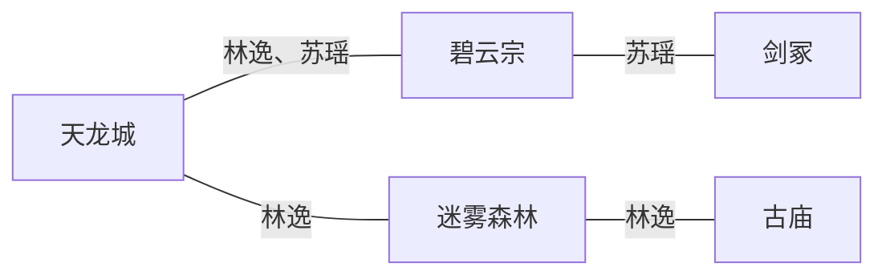

# 小说写作辅助

## 概述

帮助用户进行小说创作，管理复杂设定，追踪角色、物品、地点、伏笔、时间线等，确保长期写作的一致性。

**核心功能**：
- 多本小说管理（配置隔离）
- 完整设定追踪（角色、物品、地点、势力、时间线、伏笔）
- 大纲管理（三层：全书→卷→章节）+ 大纲排布方法论
- 章节写作（CHANGES变更声明协议、字数控制、设定自动回写、爽点标注、钩子检查、去AI味）
- 12 门禁校验（写作质量6门禁 + 引用校验 + 一致性校验 + 描写一致性 + 未知实体检测 + 蓝图出场合规 + 伏笔闭环校验）
- 事实快照集中管理（当前态快照 + 下章交接包 + 增量变更日志，解决 Big Doc 问题）
- 伏笔状态机（埋设→推进→回收/废弃，四态驱动，防漏收/错收）
- 冲突检测（跨章位置/时间线/状态/物品）
- Mermaid关系图自动生成
- 题材框架 / 风格模块 / 质量检查按需加载

> 已融合精华到 `references/` 目录下。写作流程/题材结构/角色情绪/质量润色等参考文件按需加载。
> 参考文件在 [references/](references/) 目录下，按需加载。

## 配置

配置文件路径：`~/.openclaw/workspace/skills/novel-writer-skill/configs/[小说名].json`（完整示例见 `configs/example.json` 本地模式 / `configs/example-yuque.json` 语雀模式）

> ⚠️ 实际配置不入 git 仓库，skill 重装/更新前注意备份 `configs/[小说名].json`

```json
{
  "info": {
    "name": "小说名",
    "type": "类型",
    "status": "ongoing/completed/paused",
    "created_at": "2026-04-16",
    "current_chapter": 10,
    "written_chapters": [1, 2, 3, 4, 5, 6, 7, 8, 9, 10],
    "total_words": 38000,
    "current_volume": 1,
    "last_sweet_spot": { "chapter": 10, "type": "装逼打脸" },
    "consecutive_no_spot": 0,
    "consecutive_same_type": 0,
    "last_hook_start": { "chapter": 10, "type": "悬念钩", "strength": "强" },
    "last_hook_end": { "chapter": 10, "type": "悬念钩", "strength": "强" },
    "consecutive_weak_hooks": 0,
    "last_emotion_peak": { "chapter": 10, "emotion": "震撼", "intensity": 9 },
    "consecutive_flat_emotion": 0
  },
  
  "save_location": "local",
  
  "backup": {
    "mode": "local",
    "local_path": "./小说名/backup"
  },
  
  "local": {
    "content_path": "./小说名/正文",
    "settings_path": "./小说名/设定"
  },
  
  "writing": {
    "pov": "first-person/third-person",
    "perspective": "single/multi",
    "style": "classical/modern/humorous/serious",
    "narrative_style": "fast-paced/slow-burn/detailed",
    "chapter_words": {
      "min": 2000,
      "max": 4000
    }
  }
}
```

**配置说明**：
- `save_location`：保存位置（yuque / local / both）
  - `yuque`：正文+设定都存语雀（同一个知识库，TOC 分组区分正文/设定）
  - `local`：正文+设定都存本地（两个目录）
  - `both`：双写——正文/设定同时写语雀和本地，互为备份；读取优先本地，本地缺则回退语雀
- `backup.mode`：备份模式
  - `yuque_history`（默认）：依赖语雀历史版本功能，不另做本地备份
  - `local`：在指定本地路径自动生成备份快照
- `backup.local_path`：本地备份路径（仅当 backup.mode=local 时需要）
- `info.written_chapters`：已写章节编号列表，用于追踪写作进度
- `yuque.book`：小说知识库 ID 或 namespace（二选一，至少填其一；正文+设定同库，仅语雀需要）
- `yuque.groups`：语雀分组UUID（仅语雀需要）
- `local.content_path` / `local.settings_path`：本地正文/设定保存路径（仅 save_location=local/both 时需要）
- 本地路径统一格式：`./小说名/正文` / `./小说名/设定`（相对路径以运行时的当前工作目录为基准；推荐绝对路径避免歧义）
- 配置里 `yuque` 和 `local` 两个块只需填当前 save_location 对应的块；both 时两个块都必填
- `writing`：文风设定，初始化时通过问答确定

**命名约定**：
- 设定文档名称：中文命名（如「张三.md」「天龙城.md」）
- JSON 配置 key：英文命名（如 `characters_protagonist`）
- 文件命名冲突处理：加入地点前缀（如「龙城_张三.md」）

## 命令列表

### 初始化相关

#### 新建小说
```
新建小说 [小说名]
```
**流程**：
1. 问：「小说类型是？」
2. 问：「保存到哪？A 语雀 B 本地 C 语雀+本地」（正文和设定同一处）
   - A 语雀 → 问：「知识库ID或namespace（二选一即可）」（正文+设定同一个知识库；repo 标识用数字 id 或 namespace 均可）
   - B 本地 → 问：「正文保存路径」（默认：./小说名/正文/）「设定保存路径」（默认：./小说名/设定/）
   - C 语雀+本地（双写）→ 语雀知识库（单个）和本地路径都问，正文/设定两处都写
3. 问：「人称？（第一人称/第三人称）」
4. 问：「视角？（单主角/多主角/群像）」
5. 问：「文风？（古风/现代/幽默/严肃）」（选定后映射风格模块：古风→奇幻玄幻、现代→现实世情、幽默→幽默/轻小说、严肃→悬疑/推理/恐怖，加载指引见 [references/style-modules.md](references/style-modules.md)）
6. 问：「叙事节奏？（快节奏/慢热/细腻）」
7. 问：「每章字数范围？（默认2000-4000）」
8. 问：「小说类型相关设定」（每道题标注「可随时输入"够了"跳过」）
   - 玄幻/修仙：修炼体系、等级设定...
   - 都市：势力关系、职业设定...
   - 科幻：科技水平、世界观...
9. 生成配置文件，发给你确认
10. 你确认后，创建设定文档模板
11. 根据存储方式创建设定目录结构：
    - **语雀模式**：调用语雀 API（`PUT /repos/{book_id}/toc`，body 带 action=appendNode、action_mode=child 及 title/type）自动创建目录分组，**从响应 data 直接取各分组 UUID 回写配置（无需再读）**
      - **22 个分组全建**：正文/角色/反派/配角/已故/物品/地点/势力/伏笔/时间线/大纲/关键对话/等级体系/变更日志/爽点/钩子/细纲/情绪曲线/世界观/Mermaid关系图/快照/变更记录
      - `content`（正文）分组存正文章节文档（挂 `第XXX章` DOC），建组时优先创建保证 TOC 置顶
      - 旧库缺组时自动补建：**先 `GET /toc` 查同名节点**（裸 API 同名不复用），存在则复用 UUID、缺失才 appendNode 创建（尤其 `世界观`、`Mermaid关系图`）
    - **本地模式**：在设定路径下创建完整的本地目录树（角色设定/主角+反派+配角+已故、物品设定、地点设定、势力设定、等级体系、时间线、伏笔追踪、爽点追踪、钩子追踪、情绪曲线、大纲/细纲、关键对话、世界观、Mermaid关系图、变更日志、状态快照.md、changes/）
    - **双写模式（both）**：语雀和本地两套都创建（见上方两个模式），`yuque` 和 `local` 配置块都必须填全
12. 开始写全书大纲

**设定问答中途停止**：
- 用户输入「够了」→ 用已有信息生成设定
- 提示：「后续可用"补充设定"或"更新设定"」

#### 切换小说
```
切换小说 [小说名]
切换小说 [配置文件路径]
```
**流程**：
1. 校验配置文件是否存在、格式是否正确
2. 清除上一个小说的设定缓存（上下文隔离）
3. 加载新小说配置
4. 提示切换成功

**配置校验**：
- 检查必需字段：`info.name`、`save_location`
- 检查存储路径有效性
- 若配置损坏或缺失，报错并提示修复路径

#### 状态
```
状态
```
显示当前进度：
- 当前写到第几章/第几卷
- 总字数
- 未揭晓伏笔数量
- 待处理设定冲突（如果有）
- 最近爽点间隔（正常 / 连续X章无爽点 / 同类型爽点连用X次）
- 最近钩子：章首{类型}({强度}) / 章尾{类型}({强度})
- 最近情绪：最高{情绪}({强度})（连续X章平稳）
- 最近更新

### 大纲相关

#### 写大纲
```
写大纲
```
**流程**：
1. 加载 [references/outline-arrangement.md](references/outline-arrangement.md)（大纲方法论+五步大纲法+节点设计）
2. 问：「写到什么程度？」
   - 卷级：每卷主题、关键转折、起始→结束状态
   - 章节级：每章核心事件、爽点类型、钩子类型
3. 问：「需要生成前30章细纲吗？」（推荐生成）
   - 细纲附：核心事件+爽点类型+章首钩子+章尾钩子+字数目标
4. 生成大纲时自动标记关键节点：
   - 第1章：钩子节点（留住读者）
   - 第10章左右：第一个小高潮
   - 第30章左右：第一个大高潮/转折
   - 每卷末：卷级高潮
5. 生成后跑剧情质量检查：
   - 核心冲突是否明确？
   - 升级感是否清晰（境界/地位/势力递进）？
   - 每卷是否有明确功能（铺垫/爆发/转折/收尾）？
6. 发给你确认
7. 确认后保存（全书大纲+卷大纲+章节细纲）

**细纲格式**：
```
| 章 | 核心事件 | 爽点类型 | 章首钩子 | 章尾钩子 | 字数 |
|----|----------|----------|----------|----------|------|
| 1 | 穿越觉醒 | 信息差碾压 | 悬念钩 | 悬念钩 | 3000 |
| 2 | 首战立威 | 装逼打脸 | 冲突钩 | 新角色钩 | 3200 |
```

> 细纲附**蓝图出场清单**（必出场角色/势力/地点 + 戏份要求），格式与填写规则见 [references/outline-arrangement.md](references/outline-arrangement.md)「蓝图出场清单」；写章节后按蓝图逐项核对出场（12 门禁之蓝图出场合规，即下方阶段三条目 15）。

#### 查大纲
```
查大纲
查大纲 [卷号]
查大纲 [章节号]
```

### 写作相关

#### 写章节
```
写章节 [章节号]
写章节 [章节标题]
写章节          # 不指定时，默认写最新章节（info.current_chapter + 1）
```
**流程**：

**阶段一：准备**
1. 校验配置文件有效性
2. 读取下章交接包：读 `状态快照.md` 顶部的 `## 下章交接包`（上一章留下的交接单），再读快照正文确认当前所有实体状态（不读历史）
3. 按需加载相关设定（本章涉及的角色/地点/物品的详细档案）
4. 参考本章细纲（含蓝图出场清单），必要时加载 [references/outline-arrangement.md](references/outline-arrangement.md) 和 [references/expectation-techniques.md](references/expectation-techniques.md)
5. 生成这章大纲（标注：核心事件、本章爽点类型、章首钩子类型、章尾悬念）
6. 发给你确认
7. 你确认/修改

**阶段二：写作 + 变更声明**
8. 写正文（实时字数提醒：3500字提醒进度，4000字提醒上限，不低于2000字；排版规范：全角标点“ ”、段首缩进两全角空格、不用半角标点，见 [references/anti-ai-gates.md](references/anti-ai-gates.md) Gate 5）
   - 参考 [references/style-modules.md](references/style-modules.md) 确保文风一致
   - 参考 [references/hook-techniques.md](references/hook-techniques.md) 确保钩子到位
9. **AI 必须在正文后输出 `---CHANGES---` 变更声明块**（见下方「CHANGES 变更声明协议」）

**阶段三：12 门禁校验**（全部自动，不通过则打回 AI 重写）
> 注：下方条目编号 10-16 为阶段三自有序号，其中条目 10 涵盖 6 个写作质量 Gate（Gate 1-6），全流程合计 **12 门禁**（6 写作质量 + 6 专项）。
10. **写作质量门禁**（6 Gate，全名见 [references/anti-ai-gates.md](references/anti-ai-gates.md)：Gate 1 文本健康 / Gate 2 AI句式 / Gate 3 心理外化 / Gate 4 节奏 / Gate 5 对话 / Gate 6 结尾）；本地模式跑 `node scripts/scan-text-health.js < 正文文件.md` 自检 Gate 1（词无定性，分布是判据），下列为 Gate 1 检测维度：
    - **断句检测**：逗号链（单句 ≥6 逗号警告）、句长分布（25 字+ 占比、≤8 字碎片）
    - **语句通顺检测**：口语虚词密度（净句警告）、同主语连发（连续 3+ 句同一开头）、连接词滥用（然后/接着/于是）、「是…的」书面判断腔、填充词
    - **修饰分布**：比喻密度、「只有/仅仅/恰好」封闭逻辑词（优先「还有/又」开放叙述）
    - **认知句模式**：他总觉得/这让他知道/久到/忽然（允许 1 处，成簇替换）
    - **标点硬伤**：半角标点混入、引号不成对（❌ 必须改）
    被门禁打回需重写/润色时，加载 [references/anti-ai-polish.md](references/anti-ai-polish.md)（可编辑范围分级+信息账本+修补顺序+三遍法+改写范例）
11. **引用校验**（新增）：CHANGES 中声明的角色/地点/物品/势力 ID 是否在设定中存在
    - 引用不存在的 ID → 打回，标注"未登记实体：XXX"
12. **一致性校验**（新增）：CHANGES 的声明是否与事实快照矛盾
    - 例：快照中张三在烈焰谷，CHANGES 声明张三从天剑宗出发 → 矛盾
    - 例：快照中李四已死亡，CHANGES 声明李四状态变化 → 矛盾
13. **描写一致性校验**（新增）：正文中角色外貌描写是否与角色档案矛盾
    - 加载本章出场角色的档案（发色、瞳色、外貌特征、性格标签）
    - 正文中写"张三的金色长发"但档案写黑发 → 打回
    - 正文中地点描写与地点特征档案矛盾 → 打回
14. **未知实体检测**（新增）：正文引入未登记的角色/地点/势力是否超阈值
    - 阈值：一章 ≤ 5 个新实体（区分有剧情作用的 vs 龙套）
    - 龙套（店小二、路人甲，出场 < 2 句且无姓名）不计入
    - 超阈值 → 打回，标注"新增实体过多：XXX"
15. **蓝图出场合规**（新增）：细纲/蓝图指定的角色/势力/地点是否在正文中实际出现（蓝图出场清单格式见 [references/outline-arrangement.md](references/outline-arrangement.md)「蓝图出场清单」）
    - 蓝图列出张三、李四、王五 → 正文只写了张三 → 缺额 > 阈值 → 打回
    - 视角角色仅出现 1 次 → 警告「叙事力度不足」
16. **伏笔闭环校验**（新增）：伏笔动作与伏笔状态机的一致性
    - 🔨埋设：创建新伏笔 → 必须分配唯一伏笔ID（vX），写清类型+预期读者效果，加入伏笔状态表
    - ➡️推进 / ✅回收 / ❌废弃：引用的伏笔ID 必须已在伏笔状态表中（未登记 → 打回，标注「未登记伏笔：vX」）
    - ✅回收的伏笔必须与埋设时的预期读者效果一致（回收方式和预期对不上 → 打回）
    - 状态迁移只能沿 已埋设→已推进→已回收/已废弃 方向；从已回收/已废弃回退 → 打回
    - 正文出现「像伏笔」的线索但 CHANGES 未声明且总览无此伏笔 → 打回，标注「疑似未登记伏笔，请补充设计或删除线索」
    - 伏笔埋设后 10 章未推进且未回收 → 警告「伏笔 vX 已埋设 N 章未推进」
    - 检测到旧格式伏笔（无 vX ID，如「优先级：核心/普通/彩蛋」写法）→ 警告「建议迁移到 vX 格式」，不打回

**阶段四：落地 + 状态回写**
17. 门禁全部通过后 → 上传（按 save_location：语雀 / 本地 / 双写）
    - 语雀模式：正文 DOC 创建到 `content` 分组下（`POST /repos/{book_id}/docs`，body 带 title/body/parent_uuid=content 分组 UUID）
18. **从 CHANGES 块提取变更**，自动更新设定：
    - 更新 `状态快照.md`（当前态覆盖，非追加）
      - 语雀模式：更新 `snapshot` 分组下的 DOC，用 `PUT /repos/{book_id}/docs/{doc_id}` 覆盖（doc_id 为文档数字 id 或 slug，均可）
      - 本地模式：覆盖 `设定/状态快照.md`
      - 双写模式：两处都更新
    - **覆盖 `## 下章交接包` 整段**（旧包作废）：从 CHANGES 的 `<!-- 交接包 -->` 声明生成，供下一章读取
    - **按伏笔状态机更新伏笔状态表**：🔨埋设→新增行（已埋设）；➡️推进→状态改已推进+追加推进章；✅回收→状态改已回收+写揭晓章；❌废弃→状态改已废弃
    - 保存 `ch{001}-changes.md` 到 `变更记录/` 分组（增量日志，永久保留，编号三位零填充：ch001、ch002…ch999）
      - 语雀模式：在 `changes` TITLE 节点下创建 DOC（`POST /repos/{book_id}/docs`，body 带 title/body/slug，如需挂节点带 parent_uuid）
      - 本地模式：保存到 `设定/changes/ch{001}-changes.md`
      - 双写模式：两处都保存
    - 更新各角色/地点/物品/势力/伏笔设定文档（双写模式两处都更新）
19. **冲突检测**：状态回写后自动跑冲突检测（位置/时间线/角色状态/物品），有冲突则提示
20. 反馈更新内容（含门禁结果摘要 + 冲突检测结果）
21. 更新 `info.written_chapters` 列表
22. 更新配置追踪字段：
    - `info.last_sweet_spot` / `consecutive_no_spot` / `consecutive_same_type`
    - `info.last_hook_start` / `last_hook_end` / `consecutive_weak_hooks`
    - `info.last_emotion_peak` / `consecutive_flat_emotion`
23. 更新章节摘要（含爽点类型+铺放比、钩子类型+强度、情绪基调强度链）

**门禁结果输出格式**：
```
🛡️ 门禁结果（第X章）
  ✅ Gate 1-6 写作质量：通过（禁用词0 / AI句式1处已修正）
  ✅ 引用校验：通过（CHANGES 引用 5 个实体，均在设定中）
  ✅ 一致性校验：通过
  ✅ 描写一致性：通过
  ✅ 未知实体检测：通过（新增 2 个：路人甲-龙套不计入，黑风寨-已登记）
  ✅ 蓝图出场合规：通过（指定 3 人出场，实际 3 人）
  ✅ 伏笔闭环校验：通过（埋设 v3 / 推进 v1 / 未登记 0）
  📋 交接包已更新（供第 X+1 章使用）
```

CHANGES 协议、写作技巧速查、字数节奏参考等详见 [references/changes-protocol.md](references/changes-protocol.md)。

#### 续写
```
续写
```
继续写当前未完成的章节。

**流程**：
1. 校验配置文件有效性
2. 恢复上下文：
   - 读取下章交接包（`状态快照.md` 顶部 `## 下章交接包`）
   - 读取当前章节状态（`info.current_chapter`）
   - 读取已写内容的摘要（从语雀/本地获取）
   - 按需加载相关设定（当前场景涉及的角色、地点）
3. 问：「写到哪了？/ 当前场景是？」
4. 你告诉我场景/情节
5. 继续写
6. 写完后按写章节流程的阶段二～四走（CHANGES → 12 门禁 → 落地 → 状态回写）

#### 回溯
```
回溯 [章节号]
```
显示某章详情：
- 摘要
- 出场角色
- 发生地点
- 关键事件
- 爽点（类型+铺放比）
- 钩子（章首/章尾类型+强度）
- 情绪基调（强度链）
- 伏笔
- 时间线

### 设定相关

#### 更新设定
```
更新设定
```
手动更新设定。

#### 补充设定
```
补充设定
```
继续初始化时未完成的设定问答。

#### 查设定
```
查设定 [角色名]
查设定 [物品名]
查设定 [地点名]
查设定 [伏笔]
查设定 [时间线]
查设定 [势力]
```
**数据来源**：优先读该实体的详细档案文档（本地：`设定/角色设定/主角/张三.md`；语雀：对应分组 DOC）；档案缺失时回退 `状态快照.md` 摘要（快照只含等级/位置/状态/背包/出场章，不含关系/亲密/动机等详细字段）。

**查询结果格式**：
```
【角色A】
位置：X城
状态：受伤
核心动机：复仇（深层原因：第5章家族灭门）
目标：逃离
上次出场：第10章
背包：剑、血瓶x2
等级：筑基期
关系：
  - B（朋友，亲密8，信任7，驱动力：救命之恩）
  - C（敌人，信任0，驱动力：利益冲突）
情绪变化：第5章愤怒→第8章接受
```

#### 查冲突
```
查冲突
```
检测设定冲突：
- 角色位置冲突
- 时间线冲突
- 物品归属冲突
- 角色状态冲突（已死角色出现）

**检测到冲突时**：
```
发现冲突：
- 第5章说角色A在X地
- 第10章说角色A在Y地（没写移动过程）
→ 请确认这是否是冲突？
→ 可能的解决方案：
  1. 修改第10章，补充移动过程
  2. 修改角色A在第5章的位置
```

### 其他命令

#### 更新图
```
更新图
更新图 [类型]
```
手动更新 Mermaid 关系图。默认自动更新，但可手动触发。

**支持的图表类型**：
- `地点`（默认）：地点关系图，展示地点之间的连接关系
- `角色`：角色关系图，展示角色之间的情感、阵营关系

**生成规则（地点图）**：
- 触发时机：写章节后、手动调用、新增地点时
- 节点：每个地点一个节点
- 连线：角色在两地间移动过则连线
- 标注：连线上标注移动过的角色名

**输出示例（地点关系图）**：

```mermaid
graph LR
  天龙城 ---|林逸、苏瑶| 碧云宗
  天龙城 ---|林逸| 迷雾森林
  碧云宗 ---|苏瑶| 剑冢
  迷雾森林 ---|林逸| 古庙
```

---

## 设定文档结构

### 语雀知识库（单库模式）

> 语雀没有文件夹概念，用 TOC 树实现：TITLE 节点 = 分组目录，DOC 节点 = 文档。
> 正文和设定存同一个知识库，下面的树中，`/` 结尾的是 TITLE 分组节点，`.md` 结尾的是独立 DOC 文档。

```
小说知识库（根）
├── [TITLE] 正文/             ← 正文章节 DOC（第001章、第002章…）
├── [TITLE] 角色设定/
│   ├── [TITLE] 主角组/
│   ├── [TITLE] 反派组/
│   ├── [TITLE] 配角组/
│   └── [TITLE] 已故角色/
├── [TITLE] 物品设定/
├── [TITLE] 地点设定/
├── [TITLE] 势力设定/
├── [TITLE] 等级体系/
├── [TITLE] 时间线/
├── [TITLE] 伏笔追踪/
├── [TITLE] 爽点追踪/
├── [TITLE] 钩子追踪/
├── [TITLE] 情绪曲线/
├── [TITLE] 大纲/
│   ├── [DOC] 全书大纲
│   ├── [TITLE] 卷大纲/
│   ├── [TITLE] 章节大纲/
│   └── [TITLE] 细纲/
├── [TITLE] 关键对话/
├── [TITLE] 世界观/
├── [TITLE] Mermaid关系图/
├── [TITLE] 变更日志/
├── [DOC] 状态快照          ← 独立 DOC，存当前所有实体状态
└── [TITLE] 变更记录/         ← TITLE 分组，存每章增量 CHANGES
    ├── [DOC] ch001-changes
    ├── [DOC] ch002-changes
    └── ...
```

**语雀 groups 映射**（配置文件 `yuque.groups`，22 个 key 全必填，与「22 个分组全建」一一对应）：
| key | 分组节点 | 用途 |
|-----|-----------|------|
| `content` | 正文/（TITLE） | 正文章节文档 |
| `characters_protagonist` | 角色设定/主角组/（TITLE） | 主角档案 |
| `characters_antagonist` | 角色设定/反派组/（TITLE） | 反派档案 |
| `characters_supporting` | 角色设定/配角组/（TITLE） | 配角档案 |
| `characters_deceased` | 角色设定/已故角色/（TITLE） | 已故角色档案 |
| `items` | 物品设定/（TITLE） | 物品档案 |
| `locations` | 地点设定/（TITLE） | 地点档案 |
| `factions` | 势力设定/（TITLE） | 势力档案 |
| `foreshadowing` | 伏笔追踪/（TITLE） | 伏笔文档（vX-伏笔名.md） |
| `timeline` | 时间线/（TITLE） | 时间线文档 |
| `outline` | 大纲/（TITLE） | 大纲分组节点（含全书大纲/卷大纲/章节大纲） |
| `detailed_outline` | 大纲/细纲/（TITLE，嵌套） | 细纲分组节点（旧库若平级建过则复用） |
| `dialogs` | 关键对话/（TITLE） | 关键对话记录 |
| `level_system` | 等级体系/（TITLE） | 等级体系文档 |
| `change_log` | 变更日志/（TITLE） | 按日期的变更记录（手动修正/写作后记录） |
| `sweet_spot_tracking` | 爽点追踪/（TITLE） | 爽点追踪文档 |
| `hook_tracking` | 钩子追踪/（TITLE） | 钩子追踪文档 |
| `emotion_arc` | 情绪曲线/（TITLE） | 情绪曲线文档 |
| `world_view` | 世界观/（TITLE） | 世界观文档 |
| `mermaid_graph` | Mermaid关系图/（TITLE） | 关系图文档 |
| `snapshot` | 状态快照（DOC） | `状态快照.md` 的 UUID |
| `changes` | 变更记录/（TITLE） | chXXX-changes 增量文档（永久保留） |

### 语雀 API 调用速查（2026-10-07 实弹验证）

> 优先使用 yuque-mcp 工具（`yuque_update_toc` / `yuque_create_doc` 等封装；注意 MCP 的 `createTitle` 是封装层 action，裸 API 不认）；MCP 不可用时按下方裸 API 调用。
> 认证：请求头 `X-Auth-Token: <token>`，基地址 `https://www.yuque.com/api/v2`，repo 标识用数字 id 或 namespace 均可。

**建分组（新建小说 22 组，含正文组）**：

```
PUT /repos/{book_id}/toc
{
  "action": "appendNode",   // 合法枚举：appendNode/prependNode/appendChild/moveAfter/...
  "action_mode": "child",    // 仅 sibling/child 二选一（必填）
  "type": "TITLE",
  "title": "角色设定"
}
```

- **响应 `data` 直接返回节点数组（含新节点 uuid），取 uuid 回写 `yuque.groups`，无需再 GET**
- ⚠️ 裸 API **同名不复用**：重复建同名会生成重复节点；旧库缺组补建必须**先 `GET /toc` 查同名**，有则复用 uuid、无才建
- 删除节点：`{"action":"removeNode","action_mode":"child","node_uuid":"<uuid>"}`

**创建文档（设定模板 / chXXX 变更记录）**：

```
POST /repos/{book_id}/docs
{
  "title": "张三",
  "body": "...",
  "slug": "zhangsan",        // 可选，kebab-case；不传自动生成
  "parent_uuid": "<分组uuid>"  // 挂到分组下；不传挂根
}
```

**更新文档（状态快照覆盖等）**：

```
PUT /repos/{book_id}/docs/{doc_id}
// doc_id = 文档数字 id 或 slug，均可
{ "title": "...", "body": "...", "slug": "..." }
```

**读目录（查分组/取 uuid）**：

```
GET /repos/{book_id}/toc
// 返回节点数组，含 type(TITLE/DOC)/uuid/title
```

### 本地设定文件夹

```
小说名/设定/
├── 角色设定/
│   ├── 主角/
│   ├── 反派/
│   ├── 配角/
│   └── 已故/
├── 物品设定/
├── 地点设定/
├── 势力设定/
├── 等级体系/
├── 时间线/
├── 伏笔追踪/
├── 爽点追踪/
├── 钩子追踪/
├── 情绪曲线/
├── 大纲/
│   └── 细纲/
├── 关键对话/
├── 世界观/
├── Mermaid关系图/
├── 变更日志/
├── 状态快照.md
└── changes/
    ├── ch001-changes.md
    ├── ch002-changes.md
    └── ...
```

---

**伏笔追踪分组命名**：每条伏笔一个文档，命名 `vX-伏笔名.md`（如 `v1-假死真相.md`），与快照伏笔状态表的伏笔ID 一一对应；CHANGES 伏笔动作引用的 ID 必须能在该分组中找到文档。

状态快照格式、更新规则等详见 [references/state-snapshot.md](references/state-snapshot.md)。

---

## 质量检查

写完一定章节后，加载 [references/quality-checklist.md](references/quality-checklist.md) 做检查。

**黄金三章专项**：写完前三章后自动跑评估：

| 维度 | 评分标准 |
|------|----------|
| 开篇钩子 | ★★★★★ |
| 主角塑造 | ★★★★★ |
| 爽点设计 | ★★★★★ |
| 世界观铺设 | ★★★★★ |
| 章尾悬念 | ★★★★★ |

参考 [references/opening-design.md](references/opening-design.md) 和 [references/genre-opening-database.md](references/genre-opening-database.md) 对比开篇质量。

**精修删减原则**：

改稿时逐句检查，凡符合以下条件者直接删或缩：

1. 不推动剧情的对话 → 删
2. 不铺垫反转的描写 → 删
3. 不推高情绪的心理活动 → 删
4. 读者能猜到的内容 → 缩短
5. 重复表达的情绪 → 合并

---

角色/物品/地点/势力/时间线/伏笔/爽点/钩子/情绪曲线/章节摘要/等级体系/对话记录/变更日志/大纲等所有设定文档模板详见 [references/setup-templates.md](references/setup-templates.md)。

---

## 工作流程

### 初始化流程

```
用户：新建小说「天龙传说」
↓
我：小说类型是？（玄幻/都市/科幻...）（可随时输入"够了"跳过剩余问题）
用户：玄幻修仙
↓
我：保存到哪？（A 语雀 / B 本地 / C 语雀+本地）
用户：A 语雀
↓
我：知识库ID或namespace？（二选一即可；正文+设定同一个知识库）
用户：12345678（或 yehuoshun/tianlong-novel）
↓
我：人称？（第一人称/第三人称）
用户：第三人称
↓
我：视角？（单主角/多主角/群像）
用户：多主角
↓
我：文风？（古风/现代/幽默/严肃）
用户：古风
↓
我：叙事节奏？（快节奏/慢热/细腻）
用户：慢热
↓
我：每章字数范围？（默认2000-4000）
用户：默认就行
↓
我：修仙等级体系是什么？（如炼气→筑基→金丹）
用户：炼气期、筑基期、金丹期、元婴期、化神期
↓
[继续问玄幻相关设定，用户可随时「够了」停止]
↓
我：生成配置文件
[展示配置]
↓
我：确认配置？
用户：确认
↓
我：创建设定文档模板
↓
我：[根据存储方式创建目录]
- 语雀：调用 API 创建目录分组，UUID 回写配置
- 本地：创建完整目录树（角色设定/物品设定/...全部目录结构见下方「本地设定文件夹」）
↓
开始写全书大纲
```

### 写章节流程

```
用户：写章节 10
↓
我：加载事实快照 + 本章细纲（含蓝图出场清单）
↓
我：生成章节大纲（标注：核心事件、爽点类型、出场角色、钩子类型）
[展示大纲]
↓
我：确认大纲？（可修改）
用户：确认
↓
我：写正文 + CHANGES 变更声明
[实时字数提醒：3500字/4000字]
↓
我：🛡️ 12 门禁自动执行
  ✅ Gate 1-6 写作质量：通过
  ✅ 引用校验：通过（CHANGES 引用 5 个实体，均在设定中）
  ✅ 一致性校验：通过
  ✅ 描写一致性：通过
  ✅ 未知实体检测：通过（新增 1 个：黑风寨-已登记）
  ✅ 蓝图出场合规：通过（指定 3 人出场，实际 3 人）
↓
我：上传章节 + 保存 changes/ch10-changes.md
↓
我：状态回写完成。冲突检测：无冲突。
  更新摘要：
  - 角色A 位置：X城→Y城
  - 角色A 状态：健康→轻伤（第10章，被B打伤）
  - 物品「神秘钥匙」：无主→角色A
  - 时间线：第X天→第X+3天
  - 伏笔 v1「神秘人线索」：🔨埋设（长线）| 预期读者效果：揭晓时确认黑衣人身份
  - 状态快照已更新（含下章交接包）| 伏笔状态表已更新 | Mermaid图已更新
```

### 更新设定流程

```
用户：改设定：角色A其实在B城，不是X城
↓
我：这将影响：
- 第5章：角色A在X城与C相遇
- 第8章：角色A从X城出发
确认修改？
↓
用户：确认
↓
我：设定已更新，受影响章节已标记
```

### 角色首次登场流程

```
[写章节时检测到新角色]
↓
我：检测到新角色「配角D」，请提供信息：
- 性别？
- 年龄？
- 阵营？（主角/反派/中立）
- 核心动机？（生存/复仇/守护/变强/自由/证明自己）
- 外貌描述？（可选）
- 性格特点？（可选）
用户：男，25岁，中立，守护家族，身材魁梧，沉默寡言
↓
我：已创建角色「配角D」，分组：配角组
```

---

## 特殊功能

### 爽点追踪

每章写完后自动追踪爽点密度和类型分布。

**爽点类型速查**：

| 类型 | 定义 | 示例 |
|------|------|------|
| 装逼打脸 | 实力碾压被轻视的人 | 废材一招秒天才 |
| 逆袭反转 | 绝境翻盘 | 绝境中突破 |
| 获得机缘 | 得到别人没有的东西 | 捡到神器/奇遇 |
| 信息差碾压 | 读者和主角知道、别人不知道 | 重生者先知优势 |
| 情感满足 | 人物关系进展 | 告白/团聚/认可 |
| 扮猪吃虎 | 隐藏实力突然展露 | 装弱实则强者 |

**追踪规则**：
- 每 3000-5000 字必须有一个爽点
- 连续 2 章无爽点 → 自动提醒
- 同一类型爽点连用 3 次 → 提醒换类型

**爽点间隔追踪示例**：
```
第1章：装逼打脸（铺放比3:1）
第2章：无爽点 ← ⚠️ 连续无爽点
第3章：获得机缘（铺放比1.5:1）
...
```

### 钩子追踪

每章写完后自动检查钩子质量。

**钩子类型速查**：

| 章首钩子 | 定义 | 示例 |
|----------|------|------|
| 悬念钩 | 抛出未解之谜 | 「这把剑为什么会认他为主？」 |
| 冲突钩 | 直接展示对抗 | 开篇就是追杀 |
| 反差钩 | 违反常识的信息 | 「穿越第一天就破产了」 |
| 代入钩 | 让读者产生共鸣 | 和读者处境相似的困境 |
| 信息差钩 | 给读者角色不知道的信息 | 「他还不知道，站在他面前的是…」 |

| 章尾钩子 | 定义 |
|----------|------|
| 悬念钩 | 抛出谜题等下一章解答 |
| 反转钩 | 章尾突然反转 |
| 新信息钩 | 揭示新信息打破认知 |
| 新角色钩 | 引人注目的人物登场 |
| 危机钩 | 章尾陷入危险 |
| 决策钩 | 角色面临重大选择 |

> 记录 `last_hook_start/last_hook_end.type` 时**统一使用上表 10 类词汇**；具体技法（章尾 13 式 / 章首 7 式）与追踪类的映射见 [references/hook-techniques.md](references/hook-techniques.md) 顶部「钩子式 ↔ 追踪类映射」。

**自动检查**：
- 章首无钩子（前 500 字内）→ 提醒
- 章尾无钩子 → 提醒「读者不会翻下一页」
- 连续 3 章钩子强度评为「弱」→ 提醒

### 群像角色分工

多主角/群像作品时，加载 [references/character-design.md](references/character-design.md) 检查角色分工。

**检查维度**：

| 角色 | 功能定位 | 爽点来源 | 避免重叠 |
|------|----------|----------|----------|
| A | 武力担当 | 装逼打脸 | — |
| B | 智力担当 | 信息差碾压 | 与A差异化 |
| C | 情感担当 | 情感满足 | 主线感情线 |

**自动检查**：
- 两个角色爽点来源相同 → 提醒「角色X和角色Y爽点重叠，建议差异化功能定位」
- 群像作品角色≥4时自动触发检查

### 情绪追踪

每章写完后更新情绪数据，加载 [references/emotional-arc-design.md](references/emotional-arc-design.md) 和 [references/reversal-toolkit.md](references/reversal-toolkit.md)。

**单章情绪**：章节摘要的情绪基调改为强度链格式，如 `紧张(7) → 释放(3) → 悬疑(8)`。

**跨章节情绪曲线**：每章自动录入情绪曲线文档，三种警报：
- 连续 3 章情绪极值 ≤ 5 → 提醒「情绪太平，读者会睡着」
- 反转情绪差（前后强度差）≤ 2 → 提醒「反转力度不足」
- 情绪极值密度过高（连续 5 章都≥8）→ 提醒「读者情绪疲劳，需要缓口气」

**反转检查**：章节有反转时跑四步检查：
1. 铺垫线索够不够（至少 3 个？）
2. 误导方向有没有（读者能被骗到吗？）
3. 反转后回看合不合理（不能为了反转而反转）
4. 情绪冲击够不够（前后的情绪强度差）

### 冲突检测

自动检测以下冲突：

1. **位置冲突**
   - 角色同一时间在不同地点
   - 提示：「角色A第10章在X城，第12章在Y城，缺少移动过程」

2. **时间线冲突**
   - 时间跳跃不合理
   - 提示：「第10章是第5天，第12章是第3天，时间倒流」

3. **角色状态冲突**
   - 已死角色出现
   - 提示：「角色B第10章已死亡，第15章又出现」

4. **物品冲突**
   - 物品归属不一致
   - 提示：「物品「剑」第10章被B获得，第12章还在A背包里」

### 伏笔提醒

每次写章节后，提醒未揭晓的伏笔：
```
你：写章节 20
我：[写完章节后]
当前有待揭晓伏笔：
- v1-神秘人身份（长线，第5章埋设，预期第30章回收）
- v2-古老咒语（短线，第8章埋设）
- v3-隐藏彩蛋（彩蛋，第15章埋设，可选回收）
```

### 角色等级提醒

角色等级变化后：
```
我：角色A等级变化：筑基期→金丹期（第20章突破）
```

### 完本总结

小说完结时自动生成：
```
# 完本总结

## 基本信息
- 书名：天龙传说
- 总字数：1,200,000
- 总章节：300章
- 创作时间：2026-04-16 ~ 2026-12-31

## 角色统计
- 主角：3人
- 配角：15人
- 已故角色：5人

## 伏笔统计
- 总计：20个
- 已回收：18个
- 已废弃：0个
- 未处理：2个（含彩蛋伏笔，可选回收）

## 时间线跨度
- 第1天 ~ 第365天

## 势力统计
- 王国：3个
- 宗门：5个
- 组织：2个

## 地点统计
- 城市：10个
- 区域：15个
- 秘境：3个

## 物品统计
- 核心物品：5个
- 普通物品：20个

## 爽点统计
- 总计：120个
- 类型分布：装逼打脸 30 / 逆袭反转 25 / 获得机缘 20 / 信息差碾压 15 / 情感满足 20 / 扮猪吃虎 10
- 平均铺放比：2.3:1
- 最大无爽点间隔：2章

## 钩子统计
- 章首钩子覆盖率：95%
- 章尾钩子覆盖率：92%
- 平均钩子强度：强 60% / 中 30% / 弱 10%

## 情绪统计
- 情绪峰值：第150章（震撼10）
- 情绪谷值：第50章（压抑2）
- 反转次数：15次（平均情绪差 4.2）
- 最大情绪差：第200章（9→2，差7）
- 连续平稳段：无（无连续3章情绪≤5）
```

---

## 特殊标注

正文中使用的标注符号：

```
技能：【火球术】
地名：「天龙城」
物品：『神器剑』
伏笔标记：※神秘人线索※
```

---

## 注意事项

### 必须

1. **每次写章节前校验配置**：检查配置文件存在性、格式正确性
2. **写章节前按需加载设定**：只加载相关角色/地点，不全量加载
3. **写完后更新设定**：必须询问确认
4. **更新追踪数据**：写完章节后更新 `written_chapters` 和所有追踪字段（爽点/钩子/情绪）
5. **写完跑冲突检测**：设定更新后自动跑冲突检测，有冲突报错让用户决定
6. **去AI味自动执行**：写完后自动过 6 Gate 门禁，输出摘要不询问
7. **设定变更通知**：用户手动改语雀后，必须通知我「设定已更新」
8. **切换小说时清缓存**：避免上一本小说的设定污染新会话

### 禁止

1. **禁止默默更新设定**：必须询问确认
2. **禁止无声配置**：配置变更时提示用户
3. **禁止在正文里加设定标签**：特殊标注（【】「」『』※）不会出现在正文
4. **禁止忽略冲突**：检测到冲突必须提示
5. **禁止全量加载设定**：长篇小说设定庞大，必须按需加载

### 询问节点

1. 创建知识库前
2. 创建设定文档前
3. 写章节前（大纲确认）
4. 写章节后（设定变更确认）
5. 新角色出现时
6. 检测到冲突时
7. 设定变更影响较大时

---

## 最佳实践

1. **初始化时耐心回答**：设定越完整，后期一致性越好
2. **定期检查设定**：每写完一定章节主动查设定完整性
3. **关注追踪数据**：定期查看爽点/钩子/情绪追踪，发现警报及时调整
4. **及时记录伏笔**：埋下伏笔时立即记录
5. **冲突早处理**：发现冲突立即处理，不要积累
6. **保持配置简洁**：配置文件只放核心配置，详细设定放语雀文档

---

## 参考资料

以下文件在 `references/` 目录下，按需加载（不全量加载避免 Token 爆炸）。
**加载优先级速查** → 见 [references/README.md](references/README.md)。

### 写作流程

| 文件 | 何时加载 |
|------|----------|
| [references/outline-arrangement.md](references/outline-arrangement.md) | 大纲排布：五步大纲法+故事结构分级+剧情质量控制+升级感+节点设计+矛盾设计 |
| [references/outline-arrangement-2.md](references/outline-arrangement-2.md) | 进阶：反派视角/黄金五章/断期待诊断/核心梗三分/升级文技法 |
| [references/outline-arrangement-3.md](references/outline-arrangement-3.md) | 工程化：桥段节奏/多线写长/卖点需求/开篇切入点 |
| [references/expectation-techniques.md](references/expectation-techniques.md) | 期待感设计：铺垫/爽点/多线期待+信息差+情绪模型 |
| [references/hook-techniques.md](references/hook-techniques.md) | 钩子系统：章尾钩子13式+章首钩子7式+段落级钩子+悬念编排+钩子禁忌 |
| [references/hook-techniques-2.md](references/hook-techniques-2.md) | 期待感体系：期待感模型+心理操控+反预判+高潮+情绪波浪+断期待 |
| [references/hook-techniques-3.md](references/hook-techniques-3.md) | 进阶钩子：三翻四震+上瘾模型+狗哨理论+钩子链+金手指替换 |
| [references/opening-design.md](references/opening-design.md) | 开头设计：黄金一章法则+六大标准+开头模板+诊断 |
| [references/genre-opening-database.md](references/genre-opening-database.md) | 8大题材开头模板+真实范例+决策树+书名起名法 |
| [references/style-modules.md](references/style-modules.md) | 风格模块：幽默/悬疑/言情/推理/恐怖/奇幻/现实/升级流 8 大题材风格 |
| [references/style-modules-2.md](references/style-modules-2.md) | 代入感/期待/装逼/爽点/爱情线/毒点/救赎/边界感 |
| [references/style-modules-3.md](references/style-modules-3.md) | 轻小说/沙雕/赛博朋克/盘点/模拟/直播/网站差异/打斗智斗 |
| [references/style-modules-4.md](references/style-modules-4.md) | 镜头式写作/基础技巧/舞台搭建/战斗描写/文笔 |
| [references/style-modules-5.md](references/style-modules-5.md) | 经验笔记（上）：新媒体文/商业写作/书名/留存/情绪技法 |
| [references/style-modules-6.md](references/style-modules-6.md) | 经验笔记（下）：黄金三章/市场定位/题材本质/文笔解析/新人全流程 |
| [references/dialogue-mastery.md](references/dialogue-mastery.md) | 对话节奏/潜台词/信息控制+对话模式数据库 |

### 题材与结构

| 文件 | 何时加载 |
|------|----------|
| [references/genre-frameworks-unified.md](references/genre-frameworks-unified.md) | 题材框架：追妻/重生/婚恋/世情/仙侠/高武/霸总/同人/脑洞/凡人流/历史/文娱 |
| [references/genre-frameworks-unified-2.md](references/genre-frameworks-unified-2.md) | 核心梗解析+事业线/爱情线设计 |
| [references/genre-frameworks-unified-3.md](references/genre-frameworks-unified-3.md) | 扩展题材：规则怪谈/长生流/西幻/新媒体/搞笑/飞卢/刺猬猫+进阶补充 |
| [references/story-structure.md](references/story-structure.md) | 故事结构：大纲设计/循环写法/并列式/节奏控制/情绪驱动/爽点/双线/分镜 |
| [references/story-structure-2.md](references/story-structure-2.md) | 剧情过渡/拉长剧情/换地图/长线节奏/矛盾设计 |
| [references/story-structure-3.md](references/story-structure-3.md) | 八节点结构+实用技巧（五重驱动/真相逆推/细纲实务） |
| [references/story-structure-4.md](references/story-structure-4.md) | 经验笔记（上）：卖报/拆书/三幕五幕/主线类型/冲突结构 |
| [references/story-structure-5.md](references/story-structure-5.md) | 经验笔记（下）：故事本质论/核心梗/阵营手牌/矛盾理论/悬念冲突 |
| [references/advanced-plot-techniques.md](references/advanced-plot-techniques.md) | 高级技法：小纲四步法+高潮逆推+情绪拉扯+金手指+双线+AB交织法 |
| [references/micro-innovation.md](references/micro-innovation.md) | 题材微创新+差异化设计 |

### 角色与情绪

| 文件 | 何时加载 |
|------|----------|
| [references/character-design.md](references/character-design.md) | 人物全流程：主角/配角/反派+人物关系+动机链+性格体系+配角功能 |
| [references/character-design-2.md](references/character-design-2.md) | 角色成长：主角调子/反派分量/感情流/男频女频/群像 |
| [references/character-design-3.md](references/character-design-3.md) | 经验笔记（上）：九维人设/以梗塑造/金手指与人设/大师课 |
| [references/character-design-4.md](references/character-design-4.md) | 经验笔记（下）：男频恋爱文/装逼打脸/移情标签/爽点模板 |
| [references/emotional-arc-design.md](references/emotional-arc-design.md) | 情绪曲线设计+弧形模板+期待感管理+题材赛道策略 |
| [references/reversal-toolkit.md](references/reversal-toolkit.md) | 反转类型+时机+误导底层路径 |

### 质量与润色

| 文件 | 何时加载 |
|------|----------|
| [references/quality-checklist.md](references/quality-checklist.md) | 质量检查+毒点排查+常见问题速查 |
| [references/anti-ai-gates.md](references/anti-ai-gates.md) | 6 Gate 门禁细则+质量维度+7 种 AI 模式检测（门禁必读） |
| [references/anti-ai-polish.md](references/anti-ai-polish.md) | 去AI味：可编辑范围分级+信息账本+修补顺序+三遍法+改写范例库（门禁打回/润色/重写时读） |
| [references/writing-craft.md](references/writing-craft.md) | 写作心法+毒点清单+断期待+三翻四震+心态（按需） |

| [references/writer-psychology.md](references/writer-psychology.md) | 写作心理建设+职业规划+码字习惯 |

---

_版本：v3.3.6_